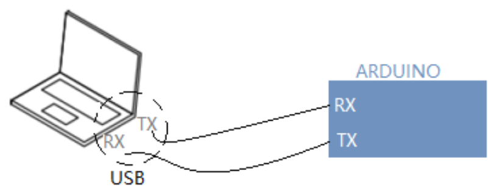
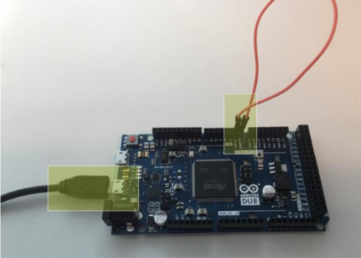
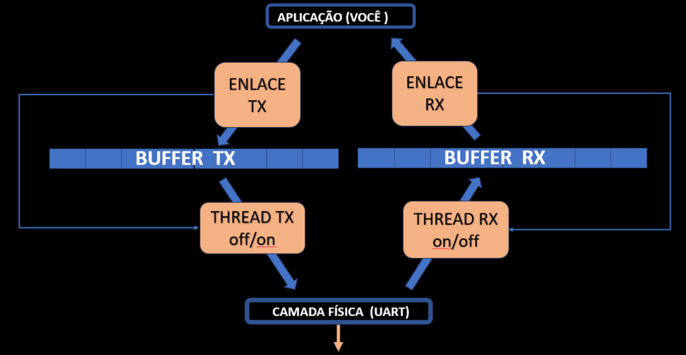

# Projeto 1 – Loop Back

Neste projeto, você deverá construir um código em **Python** para **transmissão e recepção serial simultâneas**.  
O software funcionará como **camada intermediária** entre o usuário e o chip UART, sequenciando os bits de cada byte de acordo com o protocolo.

Você utilizará **5 arquivos fornecidos** e deverá **editar apenas o arquivo `aplicação.py`**.  
Os demais arquivos já estão prontos para enviar bytes ao chip UART e receber dados.


## Objetivo

Ao rodar seu arquivo `aplicação.py`, o software deve:

1. **Enviar** uma imagem (o menor tamanho possível) através da porta de comunicação serial.
2. **Receber** a imagem simultaneamente ao envio e salvá-la como uma cópia.
   - Para isso, o pino RX do Arduino deve estar curto-circuitado com o pino TX.
3. **Compreender** o código-base de transmissão UART.


## Material Necessário

- Arduino  
- Computador  
- 5 arquivos de código fornecidos pelo professor  
- **No console Python:**  
  ```bash
  pip install pyserial
  ```
- Verificar no **Gerenciador de Dispositivos** qual porta COM está o Arduino e ajustar no `aplicação.py`.


## Montagem do Sistema



- Ao conectar o Arduino ao computador:
  - **TX do computador** → **RX do Arduino**
  - **TX do Arduino** → **RX do computador**
- Para criar o loopback:
  - Conecte o **pino TX do Arduino** ao **pino RX do próprio Arduino**.
- Alguns Arduinos (UNO) precisam:
  - Ficar com o **botão RESET pressionado**  
  - Ou **pino RESET aterrado**.




## Funcionamento Esperado

- Enviar uma sequência de bytes ou bytearray para o **RX do Arduino**  
- Receber a mesma sequência de bytes de volta no computador (**espelho**)
- O envio e recepção acontecem **full-duplex**.

---

## Estrutura da Camada Enlace

O maior desafio é compreender como as funções das classes realizam o envio e recepção **full-duplex**.



Você deve:
- Seguir o fluxo das funções no envio e no recebimento.
- Entender e ser capaz de modificar essas funções.
- Trabalhar com **imagem em Python**:
  - Converter imagem → lista de bytes
  - Receber lista de bytes → salvar como imagem

---

## Exemplo de Fluxo para Imagens

1. Definir caminho da imagem.
```python
# Endereco da imagem a ser transmitida
imageR = "./imgs/image.png"

# Endereco da imagem a ser salva
imageW = "./imgs/recebidaCopia.png"
```
2. Ler imagem e converter para `bytearray`.
```python
# Carrega imagem
print("Carregando imagem para transmissão :)")
print("- {}".format(imageR))
print("-------------------------")
txBuffer = open(imageR, 'rb').read()
```
3. Enviar via porta serial.
4. Receber os bytes.
5. Salvar como **arquivo cópia**.
```python
print("Salvando dados no arquivo :")
print(" - {}".format(imageW))
f = open(imageW, 'wb')
f.write(rxBuffer)

# Fecha arquivo de imagem
f.close()
```
6. Verificar se abre corretamente.


## Critérios de Avaliação

| Conceito | Descrição |
|----------|-----------|
| **C**    | Mostrar a transmissão e recepção da imagem ocorrendo corretamente. |
| **B**    | Atender o conceito C e responder perguntas sobre as funções: `getBufferLen`, `getAllBuffer`, `getBuffer`, `getNData`, `sendBuffer`. |
| **B+**   | Atender os conceitos C e B, além de explicar os todos os termos da comunicação UART (veja tabela abaixo). |
| **A+**   | Atender todos os conceitos anteriores e corrigir a função `getStatus` para que funcione corretamente. |


### Termos da Comunicação UART

| #  | Termo                  |
|----|------------------------|
| 1  | Transmissão assíncrona |
| 2  | UART – Start bit       |
| 3  | UART – Stop bit        |
| 4  | UART – TX, RX, GND     |
| 5  | UART – Baud rate       |
| 6  | UART – Bit rate        |
| 7  | UART – Buffer          |
| 8  | UART – Frame           |
| 9  | Bit de Paridade        |
| 10 | CRC                    |

---

## Entrega

- **Avaliação presencial**: você e sua dupla apresentarão o projeto para o professor, que fará perguntas.
- A apresentação deve ocorrer até **a próxima semana**.  
  - Após esta data, há **redução de 25% da nota por semana** de atraso.
