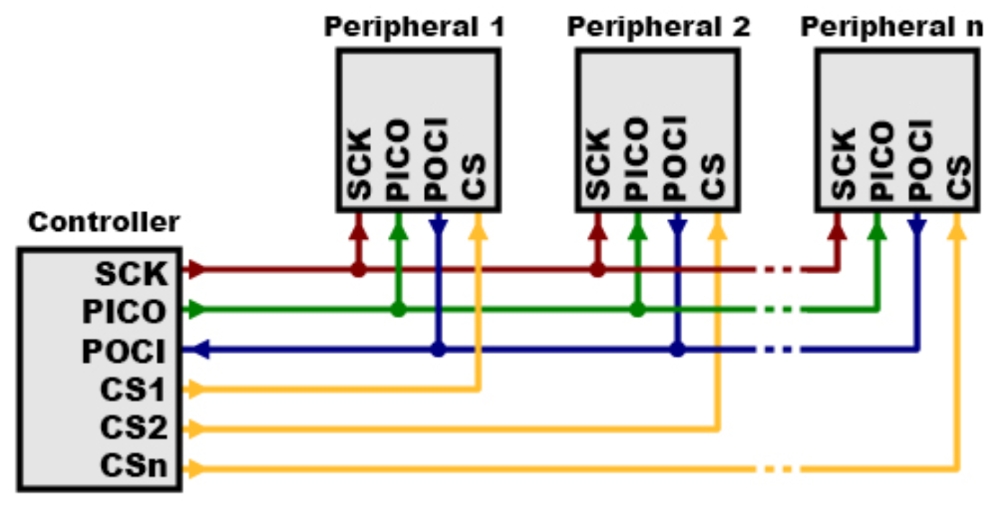
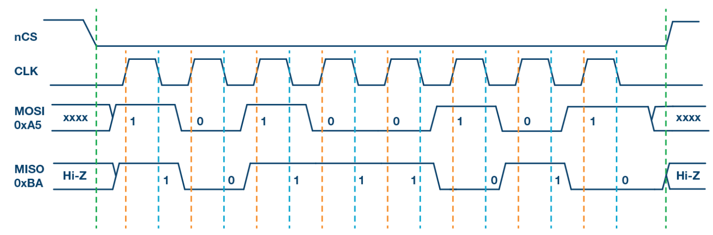
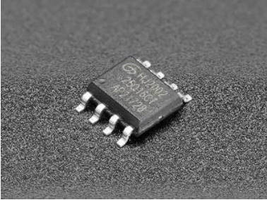
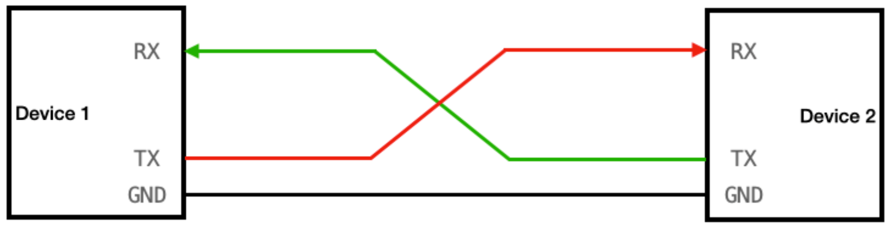
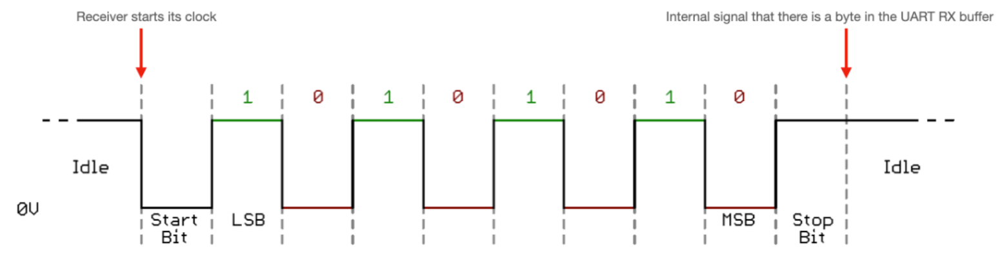
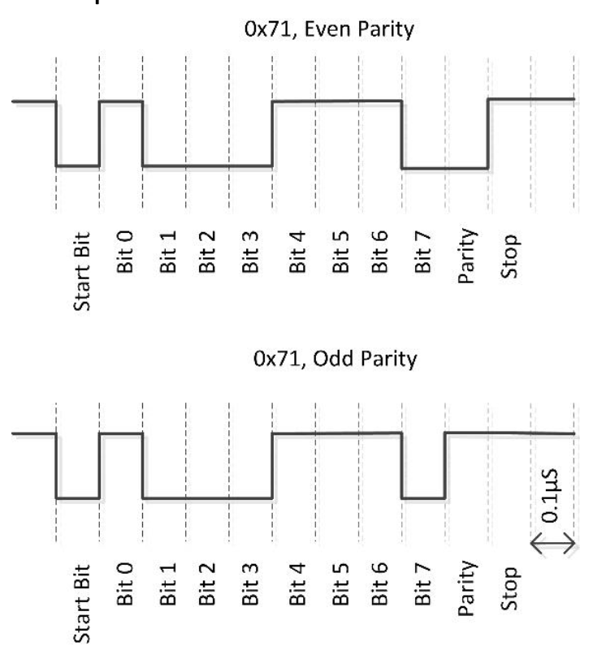
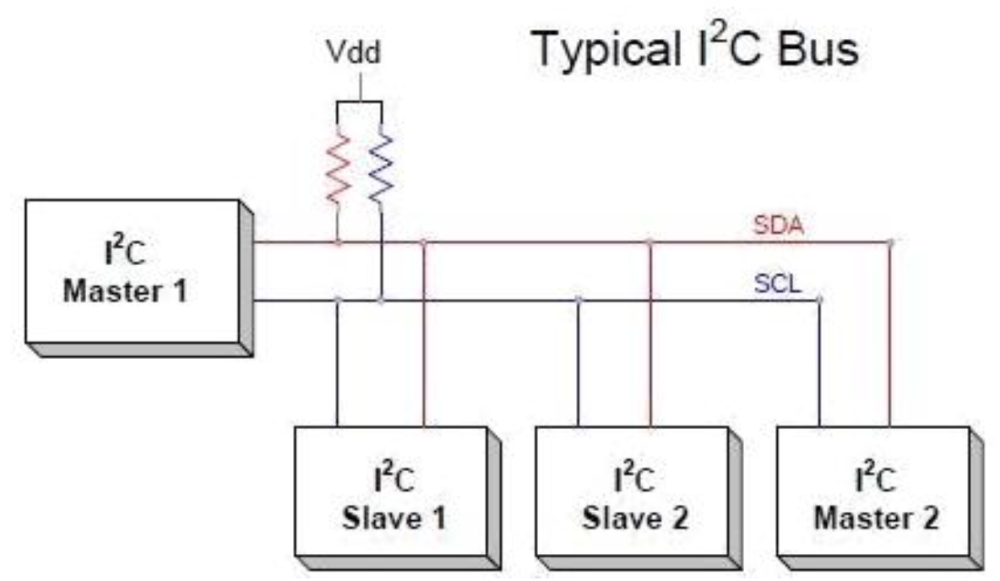
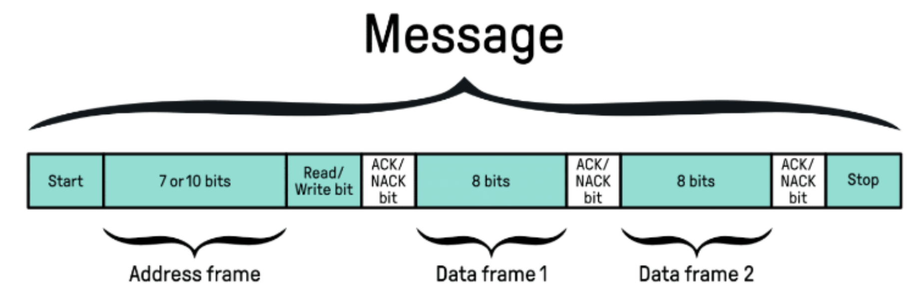
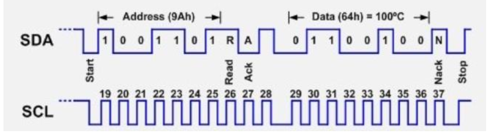

# Transmissão Serial de Dados

Faça o download do PDF de introdução:
> - [Arquivo PDF: Introdução](slides.pdf)

## Contexto Global da Transmissão de Dados

A quantidade de bytes transmitidos por minuto no planeta é gigantesca e cresce constantemente. Podemos estimar esse valor com base no tráfego global de internet. De acordo com relatórios da Cisco e outras fontes sobre o tráfego global de dados, em 2023 o tráfego de internet mundial foi aproximadamente de **500 exabytes (EB) por mês**, o que nos dá **11,6 petabytes por minuto**.

Esta quantidade não inclui ainda:
- Dados trocados entre microcontroladores e sensores
- Comunicação entre atuadores
- Transmissões internas dentro de arquiteturas de microcontroladores

Grande parte de todos esses dados são transmitidos **serialmente**. Uma alternativa seria a transmissão paralela, mais rápida mas menos robusta.

!!! exercise choice "Cálculo de Tráfego de Dados"
    Se o tráfego global de internet é de 500 exabytes por mês, quantos gigabytes são transmitidos por segundo aproximadamente?

    - [ ] 190 GB/s
    - [X] 193 GB/s
    - [ ] 200 GB/s
    - [ ] 150 GB/s

    !!! answer "Resposta!"
        500 EB/mês = 500 × 10^18 bytes/mês
        
        Em um mês (30 dias): 30 × 24 × 3600 = 2.592.000 segundos
        
        500 × 10^18 ÷ 2.592.000 ≈ 193 × 10^9 bytes/s = 193 GB/s

## Transmissão Serial vs. Paralela

### Transmissão Serial
- **Definição**: Os bits são enviados um de cada vez, sequencialmente, por um único canal de comunicação
- **Vantagens**:
  - Mais confiável para comunicações a longa distância
  - Requer menos fios ou pistas condutoras
  - Menor interferência eletromagnética
  - Comunicação eficiente em distâncias maiores
- **Exemplos**: USB, RS-232, Ethernet, comunicação de redes

### Transmissão Paralela
- **Definição**: Vários bits são transmitidos simultaneamente através de múltiplos canais (8, 16 ou 32 bits)
- **Características**:
  - Mais rápida que a serial
  - Problemas de distorção de sinal em distâncias longas
  - Maior interferência entre canais

!!! exercise choice "Comparação Serial vs Paralela"
    Qual das afirmações abaixo é a principal razão pela qual a transmissão serial é preferida para longas distâncias?

    - [ ] É mais rápida que a transmissão paralela
    - [X] Tem menor interferência eletromagnética
    - [ ] Usa mais fios para redundância
    - [ ] Não precisa de sincronização

    !!! answer "Resposta!"
        A transmissão serial usa menos fios, o que resulta em menor interferência eletromagnética entre os canais. Em longas distâncias, essa interferência se torna um problema crítico na transmissão paralela.

## Classificação da Transmissão Serial

### 1. Meio de Transmissão

#### Transmissão Guiada (com fio)
| Tipo | Características | Aplicações |
|------|----------------|------------|
| **Par trançado** | Baixo custo, fácil instalação | Redes Ethernet (RJ-45) |
| **Cabo coaxial** | Boa blindagem, média distância | Redes antigas, TV a cabo |
| **Fibra óptica** | Alta velocidade, baixa perda | Redes de longa distância |

#### Transmissão Não Guiada (sem fio)
| Tipo | Alcance | Aplicações |
|------|---------|------------|
| **Wi-Fi** | Local (até 100m) | Redes domésticas e empresariais |
| **Bluetooth** | Curto (até 10m) | Dispositivos pessoais |
| **Rádio/Satélite** | Longo (global) | Telecomunicações, TV |
| **Infravermelho** | Muito curto (linha de visão) | Controles remotos |

### 2. Direcionalidade
- **Simplex**: Transmissão unidirecional (ex.: rádio, TV)
- **Half-duplex**: Bidirecional, mas não simultânea (ex.: walkie-talkie)
- **Full-duplex**: Bidirecional simultânea (ex.: telefone)

### 3. Sincronização
- **Síncrona**: Dados transmitidos continuamente em blocos com clock comum
- **Assíncrona**: Cada caractere transmitido separadamente com bits de controle

### 4. Modulação
- **Analógica**: Sinal contínuo (AM, FM, PM)
- **Digital**: Sinal binário (ASK, FSK, PSK)

!!! exercise
    Pesquise e identifique qual tipo de direcionalidade é usado nos seguintes sistemas:
    
    1. Sistema de som ambiente de uma loja
    2. Interfone de prédio
    3. Chamada de vídeo no WhatsApp
    4. Sistema de GPS no carro
    
    Justifique suas respostas considerando o fluxo de informação em cada caso.

## Arquitetura em Camadas

O conceito de arquitetura em camadas organiza a comunicação de forma modular e estruturada. Cada camada tem função específica e interage apenas com camadas adjacentes.

### Modelo de Referência OSI

| Camada | Nome | Função Principal | Exemplos |
|--------|------|------------------|----------|
| **7** | Aplicação | Interface com usuário | HTTP, FTP, SMTP |
| **6** | Apresentação | Formatação, criptografia | SSL/TLS, JPEG |
| **5** | Sessão | Controle de conexões | NetBIOS, RPC |
| **4** | Transporte | Controle de fluxo | TCP, UDP |
| **3** | Rede | Roteamento | IPv4, IPv6 |
| **2** | Enlace | Controle de acesso ao meio | Ethernet, Wi-Fi |
| **1** | Física | Transmissão de bits | Cabos, ondas de rádio |

!!! exercise choice "Modelo OSI"
    Quando você acessa um site HTTPS, qual camada do modelo OSI é responsável pela criptografia dos dados?

    - [ ] Camada 7 - Aplicação
    - [X] Camada 6 - Apresentação
    - [ ] Camada 5 - Sessão
    - [ ] Camada 4 - Transporte

    !!! answer "Resposta!"
        A camada de Apresentação (camada 6) é responsável pela formatação, criptografia e compressão de dados. O protocolo SSL/TLS, usado no HTTPS, opera nesta camada.

## Protocolos de Comunicação Serial

### SPI (Serial Peripheral Interface)

**SPI** é um protocolo de comunicação serial síncrono desenvolvido pela Motorola nos anos 1980, usado para troca de dados entre microcontroladores e periféricos.

#### Características Principais
- **Comunicação Mestre-Escravo**: Um mestre controla múltiplos escravos
- **Transmissão Síncrona**: Clock dedicado para sincronização
- **Alta Velocidade**: Frequências de vários MHz
- **Full-Duplex**: Transmissão e recepção simultâneas

#### Pinagem SPI

| Pino | Nome Completo | Função |
|------|---------------|--------|
| **SCLK** | Serial Clock | Clock gerado pelo mestre |
| **MOSI** | Master Out, Slave In | Dados: mestre → escravo |
| **MISO** | Master In, Slave Out | Dados: escravo → mestre |
| **SS/CS** | Slave Select/Chip Select | Seleção do escravo ativo |

#### Aplicações do SPI
- Displays (OLED, TFT, e-paper)
- Memórias Flash e EEPROMs
- Sensores de alta velocidade
- Conversores AD/DA
- Módulos de comunicação (RFID, Wi-Fi, LoRa)

#### Timing SPI
O gráfico mostra a transmissão entre mestre e escravo:
- **Subida do clock**: Mestre lê MISO
- **Descida do clock**: Escravo lê MOSI

!!! exercise
    Analisando o diagrama de timing SPI acima, determine:
    
    1. Qual é o valor binário lido pelo mestre na linha MISO?
    2. Qual é o valor binário enviado pelo mestre na linha MOSI?
    3. Como você interpretaria esses valores se fossem parte de um comando para um sensor de temperatura?

#### Hardware SPI
O chip SPI recebe dados de camadas superiores, sequencializa e transmite bit a bit. Funciona como um "veículo transportador" que respeita as regras da comunicação.

!!! exercise choice "Protocolo SPI"
    Em um sistema com um microcontrolador conectado a 3 sensores via SPI, quantos pinos CS (Chip Select) são necessários?

    - [ ] 1 pino CS
    - [ ] 2 pinos CS
    - [X] 3 pinos CS
    - [ ] 4 pinos CS

    !!! answer "Resposta!"
        Cada escravo (sensor) precisa de seu próprio pino CS para ser selecionado individualmente pelo mestre. Portanto, 3 sensores = 3 pinos CS.

---

### UART (Universal Asynchronous Receiver-Transmitter)

**UART** é um protocolo de comunicação serial assíncrono amplamente utilizado em sistemas embarcados.

#### Características Principais
- **Comunicação ponto-a-ponto**: Dois dispositivos
- **Assíncrono**: Sem clock compartilhado
- **Dois fios**: TX (transmissor) e RX (receptor)
- **Conexão cruzada**: TX₁ → RX₂ e RX₁ → TX₂

#### Estrutura do Frame UART

| Campo | Bits | Função |
|-------|------|--------|
| **Start Bit** | 1 | Indica início da transmissão (sempre 0) |
| **Data Bits** | 5-9 | Dados úteis (normalmente 8 bits) |
| **Parity Bit** | 0-1 | Verificação de erro (opcional) |
| **Stop Bits** | 1-2 | Indica fim da transmissão (sempre 1) |

#### Baud Rate (Taxa de Transmissão)

Velocidades padrão em bits por segundo (bps):

| Baud Rate | Aplicação |
|-----------|-----------|
| `9600` | Padrão geral |
| `19200` | Aplicações médias |
| `38400` | Comunicação moderada |
| `57600` | Aplicações rápidas |
| `115200` | Depuração e desenvolvimento |
| `1 Mbps+` | Implementações avançadas |

!!! warning "Importante"
    Ambos os dispositivos devem usar o **mesmo baud rate**, caso contrário os dados serão corrompidos!

!!! exercise
    Calcule o tempo necessário para transmitir a palavra "HELLO" (5 caracteres) via UART com as seguintes configurações:
    
    - Baud rate: 9600 bps
    - 8 bits de dados, 1 start bit, 1 stop bit, sem paridade
    
    Mostre todos os cálculos e explique o raciocínio.

#### Verificação de Paridade

| Tipo | Descrição |
|------|-----------|
| **Par (Even)** | Número total de bits "1" deve ser par |
| **Ímpar (Odd)** | Número total de bits "1" deve ser ímpar |
| **Nenhuma (None)** | Sem verificação de paridade |

!!! exercise choice "Verificação de Paridade"
    Considere o byte de dados `11010110`. Qual seria o bit de paridade para uma configuração de paridade PAR?

    - [X] 0
    - [ ] 1

    !!! answer "Resposta!"
        O byte `11010110` tem 5 bits "1". Para paridade PAR, o número total de bits "1" (incluindo o bit de paridade) deve ser par. Como 5 é ímpar, o bit de paridade deve ser 0 para tornar o total par (5 + 0 = 5, ainda ímpar... erro na questão! Deveria ser 1 para tornar 6, que é par).

#### Detecção de Erros
- **Parity Error**: Bit de paridade incorreto
- **Framing Error**: Bit de stop não encontrado
- **Overrun Error**: Receptor sobrecarregado

#### Hardware UART
Microcontroladores modernos incluem chips UART como periféricos. A comunicação com o chip é feita por camadas superiores de software.

### I²C (Inter-Integrated Circuit)

**I²C** é um protocolo de comunicação serial desenvolvido pela Philips (NXP) que utiliza apenas dois fios para comunicação entre múltiplos dispositivos.

#### Características Principais
- **Barramento compartilhado**: Múltiplos dispositivos em 2 fios
- **Endereçamento**: Cada dispositivo tem endereço único (7 ou 10 bits)
- **Mestre-Escravo**: Mestre controla a comunicação
- **Half-duplex**: Transmissão ou recepção, não simultânea

#### Pinagem I²C

| Pino | Nome Completo | Função |
|------|---------------|--------|
| **SCL** | Serial Clock Line | Clock compartilhado |
| **SDA** | Serial Data Line | Dados bidirecionais |

#### Especificações Técnicas

| Parâmetro | Valor |
|-----------|-------|
| **Tensão** | 3,3V ou 5V |
| **Velocidade Padrão** | 100 kbit/s |
| **Velocidade Rápida** | 400 kbit/s |
| **Velocidade Rápida Plus** | 1 Mbit/s |
| **Dispositivos máximos** | 128 (endereço 7 bits) |

#### Protocolo de Comunicação

1. **Endereçamento**: Mestre envia endereço do escravo
2. **Confirmação**: Escravo responde com ACK
3. **Transmissão**: Dados são transmitidos
4. **Verificação**: ACK/NACK confirma recepção

#### Estrutura do Frame I²C

| Campo | Bits | Função |
|-------|------|--------|
| **Start Bit** | 1 | Início da transmissão |
| **Address** | 7-10 | Endereço do dispositivo |
| **R/W Bit** | 1 | Read (1) ou Write (0) |
| **ACK/NACK** | 1 | Confirmação do escravo |
| **Data** | 8 | Dados úteis |
| **ACK/NACK** | 1 | Confirmação dos dados |
| **Stop Bit** | 1 | Fim da transmissão |

#### Exemplo Prático
Transmissão do byte `01100100` (decimal 100) para o escravo `1001101`:

!!! exercise
    Analisando a comunicação I²C mostrada no exemplo acima:
    
    1. O que aconteceria se o escravo enviasse NACK em vez de ACK?

#### Vantagens e Desvantagens

**Vantagens:**
- Apenas 2 fios para múltiplos dispositivos
- Protocolo padronizado e amplamente suportado
- Endereçamento automático
- Baixo custo de implementação

**Desvantagens:**
- Velocidade inferior ao SPI
- Não ideal para longas distâncias
- Barramento compartilhado pode criar gargalos

!!! exercise choice "Comparação de Protocolos"
    Qual protocolo seria mais adequado para conectar um display OLED de alta resolução que precisa de atualização rápida?

    - [X] SPI
    - [ ] I²C
    - [ ] UART
    - [ ] RS-232

    !!! answer "Resposta!"
        O SPI é mais adequado pois oferece maior velocidade de transmissão (vários MHz) e comunicação full-duplex, essenciais para atualizações rápidas de displays de alta resolução.

## Outros Protocolos de Comunicação Serial

Existem diversos outros protocolos especializados:

| Protocolo | Características | Aplicações |
|-----------|----------------|------------|
| **RS-232** | Comunicação serial padrão antiga | Equipamentos industriais legados |
| **RS-485** | Comunicação diferencial, longas distâncias | Redes industriais, automação |
| **CAN** | Robusto, tolerante a falhas | Automotivo, sistemas críticos |
| **1-Wire** | Um único fio + GND | Sensores de temperatura |
| **USB** | Universal, alta velocidade | Periféricos de computador |

!!! exercise
    Projete um sistema de monitoramento para uma estufa automatizada que precisa:
    
    - Ler 10 sensores de temperatura distribuídos
    - Controlar 5 atuadores (bombas, ventiladores)
    - Comunicar com um computador central
    - Operar em ambiente com interferência eletromagnética
    
    Escolha os protocolos mais adequados para cada parte do sistema e justifique suas escolhas.

## Leituras Complementares

Para aprofundamento em transmissão serial UART:

1. [FreeBSD Serial UART Guide](https://docs.freebsd.org/pt-br/articles/serial-uart/)
2. [UNESP - Comunicação Serial](http://www1.rc.unesp.br/igce/demac/alex/disciplinas/MicroII/EMA864315-Serial.pdf)
3. [USP - Transmissão e Recepção Assíncrona](https://www2.pcs.usp.br/~labdig/pdffiles_2012/tx_e_rx_as.pdf)
4. [University of Wisconsin - UART Basics](https://ece353.engr.wisc.edu/serial-interfaces/uart-basics/)

