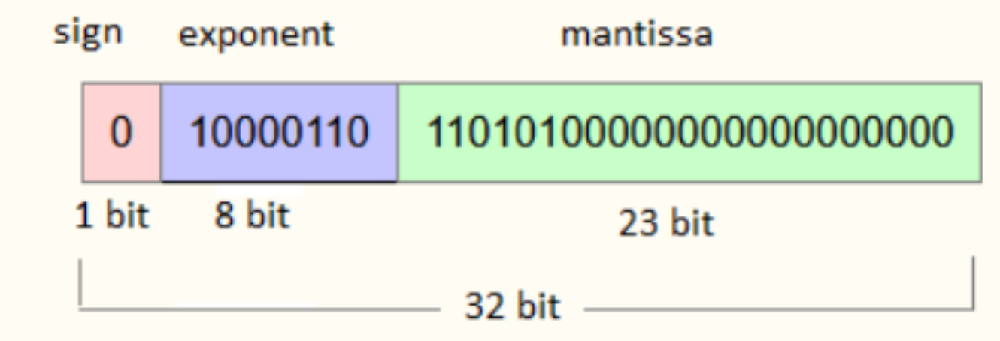

# Projeto 2 – Desafios Client/Server

Nesse segundo projeto você e sua dupla irão construir uma aplicação utilizando os arquivos base fornecidos no projeto 1. No entanto, para que vocês fiquem mais íntimos desses arquivos, preparando o terreno para o projeto 3, alguns desafios serão propostos.

## 1) Arquitetura

Primeiramente, agora vocês deverão ter arquivos separados para o cliente e para o servidor. Aconselha-se ter os 5 arquivos cliente em um computador e os 5 arquivos server em outro computador. Quando estivermos comunicando dois computadores a arquitetura deverá envolver dois arduinos, cada um conectado a um computador. Você terá que descobrir como conectar os Arduinos. Precisará de jumpers.


## 2) Inicialização

A aplicação server deverá ser inicializada antes da aplicação cliente. Feito isso a aplicação server deve permanecer em um estado de espera por qualquer envio de dados vindos do cliente.

O primeiro byte a ser então enviado pelo client deve ser um byte de sacrifício. Isso porque há um problema de hardware com as portas dos computadores que geram dados espúrios ao serem inicializadas e corrompem o promeiro byte. Sendo assim, usamos um primeiro byte para gerar o erro e depois tudo ocorrer normalmente.

O server deve então ser iniciado de maneira a ficar esperando esse byte de sacrifício. Para isso, copie o seguinte código na aplicação server logo após o enable da porta COM:

```python
print("esperando 1 byte de sacrifício")
rxBuffer, nRx = com1.getData(1)
com1.rx.clearBuffer()
time.sleep(.1)
```

No lado cliente, ao ser inicializado (após a inicialização do server), deverá enviar o byte de sacrifício. Para o envio desse byte de sacrifício, copie as linhas a seguir logo após o enable da porta COM:

```python
time.sleep(.2)
com1.sendData(b'00')
time.sleep(1)
```

Feito o envio (pelo lado client) do byte de sacrifício, o server deve receber esse byte (corrompido) e desprezá-lo.
Você deverá ver no prompt uma mensagem de erro do tipo:

```python
"[ERRO] interfaceFisica, read, decode. buffer:"
```

Esse erro foi causado porque o byte foi corrompido e não foi possível decodificá-lo. Mas agora tudo funcionará bem para os próximos bytes.

Após receber e desprezar esse byte de sacrifício, o server deve voltar ao estado de espera da um próximo envio.

## 3) O que deve ser enviado

Uma aplicação (client) deverá enviar via transmissão serial UART uma sequência de números. Cada número deverá estar entre os intervalos `[− 1 ⋅ 1038 ; + 1 ⋅ 1038 ]` e possuir no mínimo 6 casas de precisão. Exemlo:

- 45 , 450000
- − 1 , 43567
- 1 , 23 ⋅ 1023

Os números serão recebidos pelo server, que deverá “printá-los” no prompt **separadamente (1 número por linha).**

O cliente deverá enviar uma certa quantidade de números, entre 5 e 15. O server não saberá a quantidade denúmeros que irá receber. Os números a serem enviados podem estar “hard coded” ou informado pelo usuário.

Após a recepção, o server deverá retornar ao client uma mensagem informando a soma de todos os números
recebidos. Essa resposta deve também ter a mesma precisão de 6 dígitos.

Caso a soma retornada pelo server não esteja correto na resposta, o cliente deverá expor uma mensagem avisando a inconsistência.

Se o server não retornar nada em até 5 segundos, o cliente deverá expor uma mensagem de `time out`.

!!! info
    **Importante! Lembre-se que o server não conhece a quantidade de números que serão transmitidos!**

## 4) Avaliação

Você e sua dupla deverão apresentar para seu professor o código funcionando em 3 situações.

1. Você deverá simular um caso de sucesso de transmissão.
2. Um caso de erro (server recebeu os comandos com problema de interpretação). Nesse caso você pode
    forçar um erro com algo “hard coded” no seu código server para simular a situação.
3. Um caso de ausência de resposta por parte do server e mensagem de time out do cliente.

- **Nota C** conseguir enviar os números corretamente e o print for feito corretamente no lado server.

- **Nota C+** conseguir enviar os comandos, server respondendo com a soma dos números recebido, não há excesso de
dados e metadados sendo transferidos e o tempo de envio não for alto, sem pausas ou esperas.

- **Nota B** Adicionar time out.

- **Nota A+** Todos os itens anteriores no formato de ponto flutuante 32 bis IEEE, conforme explicado em aula.

!!! tip
    Tente **não alterar** as camadas _enlace, enlaceRx, enlaceTx_ e _InterfaceFisica_.


### Base teórica sobre ponto flutuante 32 bits IEEE- 754

Lembre-se da explicação feita em sala pelo seu professor. Tente codificar os números no padrão IEEE- 754 ou usar uma biblioteca. Ao usar a biblioteca você deverá verificar a codificação.

Use sites e informações de sua IA favorita para relembrar o ponto flutuante 32bits.

