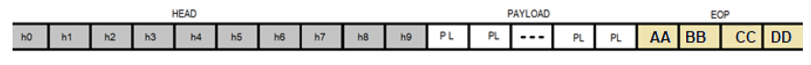

# Enunciado do Projeto 03

Nesse projeto, sua aplicação que exerce o papel de **client** deverá enviar um arquivo para a aplicação **server**.  
Esse arquivo deverá ser fragmentado e enviado através de “pacotes” (*datagramas*).  
Deverá existir **handshake** e **confirmação de recebimento** de cada pacote.

## Estrutura do Datagrama

A partir de agora, você está **PROIBIDO** de trocar mensagens entre *server* e *client* que não sejam um datagrama completo (um pacote).  
Isso significa que, mesmo que queira enviar um único byte, mesmo que não faça parte dos dados a serem enviados, deverá enviar um pacote compondo um datagrama.

Estrutura definida:

- **HEAD** – 12 bytes (fixo)  
- **PAYLOAD** – variável, entre 0 e 70 bytes (pode variar de pacote para pacote)  
- **EOP** – 3 bytes (fixo, valores de livre escolha)  

> Não importa o tipo de mensagem, sempre será enviada através de um datagrama como definido acima, tanto de *client* para *server* como no sentido oposto.

## Handshake

Antes do envio da mensagem, o **client** deve enviar uma mensagem para verificar se o **server** está “vivo” e pronto para receber o arquivo.  
O **server** responde confirmando que está pronto para receber.

- Enquanto a mensagem de confirmação não for recebida, o cliente **não inicia** o envio.
- Caso o cliente não receba resposta dentro de **3 segundos**, o usuário deve receber a mensagem:  
  `"Servidor inativo. Tentar novamente? S/N"`.
- Se o usuário escolher **S**, outra mensagem de verificação é enviada ao *server*.  
  Se escolher **N**, o processo se encerra.
- Caso o servidor responda em menos de 3 segundos, o cliente inicia a transmissão enviando o **primeiro pacote**.

## Fragmentação

Como o *payload* é menor que o arquivo, ele deve ser enviado em partes (pacotes).  
Cada pacote deve seguir obrigatoriamente a estrutura do datagrama.

**Motivos para fragmentar:**
- Limitação de hardware (pouco espaço no *buffer*).
- Gestão do tempo de ocupação do canal de comunicação.
- Evitar retransmissão completa em caso de erro, possibilitando reenviar apenas o fragmento com problema.

## Acknowledge / Not Acknowledge

Durante a transmissão, é comum trocar mensagens de:
- Confirmação de recebimento de um pacote.
- Notificação de erro na recepção de um pacote.

> Isso aumenta a robustez da comunicação, mas pode afetar a velocidade de transmissão.  
> Existe um compromisso entre velocidade e segurança no que diz respeito à integridade dos dados.

## Funcionalidades Obrigatórias

- O datagrama **não pode ultrapassar 85 bytes**.  
  O *payload* será menor, exigindo fragmentação da imagem a ser enviada.
- Ao enviar um pacote, o cliente deve indicar no **HEAD**:
  - Número do pacote.
  - Número total de pacotes a serem transmitidos.
- Ao receber um pacote, o servidor deve:
  - Verificar se o número do pacote é **1 a mais** que o anterior (ordem correta).
  - Verificar se o **EOP** está no local correto e completo.
- Se tudo estiver correto:
  - O servidor envia mensagem para que o cliente envie o próximo pacote.
- O cliente **não envia** o próximo pacote sem a confirmação do servidor.
- Se houver erro:
  - O servidor solicita o **reenvio** do pacote (payload incorreto ou ordem errada).
- Ao receber o último pacote:
  - O servidor reagrupa os pacotes e salva o arquivo original.
  - Responde ao cliente confirmando **sucesso na transmissão**.
- Se houver erro de transmissão:
  - O cliente **encerra** a comunicação sem tentar corrigir e prosseguir.

## Critérios de Entrega

Fique atento a data de entrega.

### Conceito C
- Transmissão de sucesso, com o servidor recebendo os pacotes, conferindo e respondendo ao cliente.

### Conceito B-
- Simulação de *server* inativo por mais de 3 segundos, forçando novo handshake.  
  - O cliente tenta **2 vezes** iniciar sem sucesso e na **3ª vez** o servidor responde e inicia a transmissão.
- Simulação em que o cliente envia pacote com número errado e o servidor responde adequadamente.
- Simulação em que o tamanho real do *payload* não corresponde ao informado no HEAD.

### Conceito A+
- Simulação em que, se os fios entre os Arduinos forem desconectados e reconectados, a transmissão retorna e termina com sucesso.

# Exemplo de Protocolo em Pacotes com Garantia Total de Entrega  
*(Este exemplo é mais complexo que o Projeto 3)*

## Estrutura do HEAD

| Campo | Descrição |
|-------|-----------|
| **h0** | Tipo de mensagem |
| **h1** | Livre |
| **h2** | Livre |
| **h3** | Número total de pacotes do arquivo |
| **h4** | Número do pacote sendo enviado |
| **h5** | Tipo para *handshake*: ID do arquivo (crie um) |
| **h5** | Se tipo for *dados*: tamanho do payload |
| **h6** | Pacote solicitado para recomeço quando há erro no envio |
| **h7** | Último pacote recebido com sucesso |
| **h8 – h9** | CRC (*Por ora deixe em branco. Fará parte do Projeto 5*) |

## Estrutura do PAYLOAD

- Variável, entre **0 e 114 bytes**.  
- Reservado à transmissão dos arquivos.

## Estrutura do EOP

- **4 bytes**: `0xAA 0xBB 0xCC 0xDD`

**Importante:**  
> A métrica para seu sucesso são **a integridade dos dados recebidos** e o **throughput**!

## Padrão de Comunicação

- **UART**, baudrate **115200**, sem bit de paridade.

## Definição de Datagrama

Cada envio deve ser feito como um **datagrama completo**, contendo **head**, **payload** e **EOP**.  
Não é permitido envios que não contenham *head*, *payload* (ocasionalmente nulo) e *EOP*.  

**Restrições:**
- Tamanho máximo do *payload*: **114 bytes**
- Tamanho máximo do *datagrama*: **128 bytes**

## Tipos de Mensagens

### **TIPO 1**
Mensagem enviada pelo cliente convidando o servidor para a transmissão.  
- `h0` = **1** (indica mensagem tipo 1)  
- Outro *byte* com identificador do arquivo.  
- O servidor verifica se é para ele mesmo e confirma o envio.  
- Inclui o número total de pacotes que serão enviados.

### **TIPO 2**
Mensagem enviada pelo servidor ao cliente após receber a **TIPO 1** com sucesso.  
- Indica que está pronto para receber e enviar pacotes.  
- `h0` = **2**.

### **TIPO 3**
Mensagem de envio de dados.  
- Forma um bloco do arquivo.  
- Contém:
  - Número do pacote enviado (começando em 1)
  - Número total de pacotes a serem enviados

### **TIPO 4**
- Enviada **do servidor para o cliente** sempre que uma mensagem **TIPO 3** for recebida e validada com sucesso.
- Condições para envio:
  - O pacote recebido é exatamente o esperado pelo servidor.
  - A mensagem chegou **em perfeitas condições** (EOP no local correto).
- Função:
  - Confirmar ao cliente que o pacote foi recebido.
- Estrutura:
  - `h0` = **4** (tipo da mensagem).
  - Deve conter o **número do último pacote** recebido e validado.

### **TIPO 5**
- Mensagem de **timeout**.
- Condições para envio:
  - Sempre que o tempo limite de espera (timer) for excedido, **em qualquer um dos lados** da comunicação.
- Função:
  - Encerrar a conexão após falha por tempo excedido.
- Estrutura:
  - `h0` = **5** (tipo da mensagem).

### **TIPO 6**
- Mensagem de **erro** enviada **do servidor para o cliente** quando uma mensagem **TIPO 3** é inválida.
- Condições de invalidez:
  - Pacote com bytes faltando.
  - Formato incorreto.
  - Pacote não esperado (repetido ou fora de ordem).
- Função:
  - Informar ao cliente que o pacote recebido é inválido.
  - Orientar para o **reenvio** do pacote correto.
- Estrutura:
  - `h0` = **6** (tipo da mensagem).
  - `h6` = **número correto do pacote esperado pelo servidor**, independente do motivo da invalidez.

  