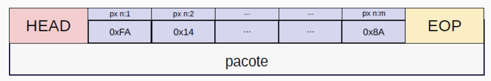

# Introdução à Comunicação por Datagramas

Normalmente, a camada responsável pela transmissão dos dados gerados em camadas superiores realiza a transmissão de duas formas: dados fragmentados em pacotes (datagramas) ou streaming. As principais diferenças entre uma transmissão em streaming e uma transmissão baseada em pacotes (datagramas) estão relacionadas à forma como os dados são enviados, recebidos e processados. Vamos analisar cada uma:

## Transmissão em Streaming

- **Definição**: É uma forma de transmissão contínua de dados, geralmente usada para conteúdos multimídia (áudio e vídeo).
- **Protocolo comum**: Utiliza protocolos como RTP (Real-time Transport Protocol) sobre UDP ou HLS/DASH sobre HTTP.
- **Modo de entrega**: Os dados são entregues e processados continuamente, permitindo a reprodução do conteúdo quase em tempo real, sem necessidade de download completo.
- **Latência**: Baixa a moderada, dependendo da técnica utilizada (por exemplo, buffering para evitar interrupções).
- **Controle de erro**: Pode tolerar pequenas perdas sem comprometer significativamente a experiência do usuário.
- **Exemplos de uso**: Plataformas como Netflix, YouTube, Spotify e transmissões ao vivo.

## Transmissão em Pacotes (Datagramas)

- **Definição**: Baseia-se no envio de pacotes de dados independentes, onde cada datagrama pode seguir um caminho diferente na rede.
- **Exemplos**: Protocolos como UDP (User Datagram Protocol), que não garante a entrega ou a ordem dos pacotes. E protocolos como o TCP (Transmission Control Protocol), que provê garantia de entrega.
- **Modo de entrega**: Os pacotes são enviados de forma discreta, sem garantir que chegarão na mesma ordem ou mesmo que serão entregues (dependendo do protocolo).
- **Latência**: Aumenta quando há necessidade de confirmação de recebimento de pacotes, como no TCP.
- **Controle de erro**: Garantia de retransmissão no caso do TCP.
- **Exemplos de uso**: Aplicações em tempo real como VoIP (ligações pela internet), jogos online, DNS, transmissões multicast.

!!! exercise choice "Diferenças entre Streaming e Datagramas"
    Qual das características abaixo é específica da transmissão em streaming?

    - [X] Permite reprodução do conteúdo quase em tempo real sem download completo
    - [ ] Utiliza pacotes independentes que podem seguir caminhos diferentes
    - [ ] Garante a entrega de todos os dados transmitidos
    - [ ] Requer confirmação de recebimento para cada pacote

    !!! answer "Resposta!"
        A transmissão em streaming permite a reprodução do conteúdo quase em tempo real sem necessidade de download completo, diferentemente da transmissão por datagramas que envia pacotes independentes.

## Como são os pacotes (datagramas)

Um datagrama é tipicamente dividido em 3 partes:

- Um cabeçalho (header)
- Payload (dados)
- EOP (end of package)

Nos bytes reservados ao cabeçalho são colocados os bytes de comunicação entre as partes. O metadado. Com os bytes posicionados nas posições corretas, as partes podem conversar. Confirmar envio, informar quem está enviando, qual o número do pacote, qual o tamanho do payload, confirmar recebimento... Enfim, esses bytes são utilizados para uma conversa entre as partes.

No payload são colocados os bytes de dados que foram acomodados no pacote.

O EOP é uma espécie de fim de pacote, é uma sequência combinada que marca o fim do pacote.

!!! exercise choice "Estrutura do Datagrama"
    Qual é a função principal do cabeçalho (header) em um datagrama?

    - [ ] Armazenar os dados úteis da transmissão
    - [X] Contém metadados para comunicação entre as partes
    - [ ] Indicar o fim do pacote
    - [ ] Comprimir os dados para economizar banda

    !!! answer "Resposta!"
        O cabeçalho contém metadados essenciais para a comunicação entre as partes, como informações de controle, endereçamento, numeração de pacotes e confirmações.

## Por que enviar os dados segmentados em pacotes?

Os principais motivos para o uso de transmissão em pacotes são:

### 1. Eficiência na utilização da rede
- Dividir dados em pacotes permite que várias transmissões ocorram simultaneamente na rede.
- Diferentes pacotes podem seguir rotas distintas para evitar congestionamentos.
- Se um pacote for perdido, somente ele será retransmitido, e não toda a mensagem.

### 2. Melhor controle de erro
- Cada pacote contém um *checksum* para verificar a integridade dos dados.
- Se houver erro na transmissão, apenas o pacote corrompido será reenviado, reduzindo desperdício de banda.

### 3. Gerenciamento de tráfego e controle de congestionamento
- Protocolos como **TCP** ajustam o tamanho dos pacotes e a taxa de envio conforme a capacidade da rede.
- Se a rede estiver congestionada, pacotes podem ser redirecionados ou retransmitidos.

### 4. Fragmentação e reassemblagem
- Pacotes menores são mais fáceis de transportar e evitam bloqueios em redes de diferentes capacidades.
- Dispositivos intermediários, como roteadores, podem fragmentar ou juntar pacotes conforme necessário.

### 5. Comunicação mais robusta e confiável
- Se uma conexão for interrompida, pacotes já transmitidos não são perdidos.
- A comunicação pode ser mantida mesmo com falhas parciais na rede.

!!! exercise choice "Vantagens da Segmentação"
    Qual é a principal vantagem de segmentar dados em pacotes quando ocorre um erro de transmissão?

    - [ ] Todos os dados precisam ser retransmitidos
    - [ ] A velocidade de transmissão aumenta automaticamente
    - [X] Apenas o pacote corrompido precisa ser reenviado
    - [ ] O erro é automaticamente corrigido sem retransmissão

    !!! answer "Resposta!"
        Uma das principais vantagens da segmentação é que, em caso de erro, apenas o pacote corrompido precisa ser retransmitido, não toda a mensagem, economizando banda e tempo.

## Exemplo de datagrama: Cabeçalho TCP  

Exemplo de datagrama: Cabeçalho TCP *(20 bytes fixos + opções variáveis)*

| Campo               | Tamanho (bits) | Descrição |
|---------------------|----------------|-----------|
| **Porta de origem** | 16             | Número da porta do remetente |
| **Porta de destino**| 16             | Número da porta do destinatário |
| **Número de sequência** | 32        | Indica a posição do primeiro byte deste segmento dentro do fluxo de dados |
| **Número de confirmação (ACK)** | 32 | Confirma o recebimento do último segmento válido do emissor |
| **Tamanho do cabeçalho** | 4        | Indica o tamanho do cabeçalho TCP (mínimo 20 bytes) |
| **Reservado**       | 3              | Reservado para uso futuro |
| **Flags de controle** | 9            | Indica o estado da conexão (SYN, ACK, FIN, etc.) |
| **Tamanho da janela** | 16           | Quantidade de bytes que o receptor pode aceitar sem receber confirmação |
| **Checksum**        | 16             | Verifica a integridade do segmento |
| **Ponteiro de urgência** | 16        | Indica se há dados urgentes (caso a flag URG esteja ativa) |
| **Opções TCP**      | Variável       | Usado para configurações extras, como escala de janela, timestamps, etc. |

Além do cabeçalho, o protocolo TCP possui um **payload variável**, com tamanho máximo de **1469 bytes**.  
O tamanho do payload de cada pacote é normalmente informado no próprio cabeçalho.

!!! exercise choice "Cabeçalho TCP"
    Qual campo do cabeçalho TCP é responsável por garantir que os dados não foram corrompidos durante a transmissão?

    - [ ] Número de sequência
    - [ ] Flags de controle
    - [X] Checksum
    - [ ] Tamanho da janela

    !!! answer "Resposta!"
        O campo Checksum é responsável por verificar a integridade do segmento, garantindo que os dados não foram corrompidos durante a transmissão.

## Explicação dos principais campos do cabeçalho TCP

### 1. Número de sequência (*Sequence Number*)
- Indica qual é o primeiro byte do segmento dentro do fluxo de dados.
- Importante para **remontar os dados na ordem correta**.

### 2. Número de confirmação (*Acknowledgment Number*)
- Usado pelo destinatário para informar **qual o próximo byte esperado**.
- Se um segmento for perdido, ele não será confirmado, e o remetente o reenviará.

### 3. Flags de controle (*9 bits*)
- **URG (Urgent)** → Indica dados urgentes.
- **ACK (Acknowledgment)** → Confirma recebimento de dados.
- **PSH (Push)** → Solicita entrega imediata ao aplicativo.
- **RST (Reset)** → Reinicia a conexão abruptamente.
- **SYN (Synchronize)** → Inicia uma conexão.
- **FIN (Finish)** → Finaliza uma conexão.

### 4. Tamanho da Janela (*Window Size*)
- Define **quantos bytes o receptor pode armazenar** antes de precisar enviar uma confirmação.
- Essencial para o **controle de congestionamento** e **fluxo de dados**.

### 5. Checksum
- Validado pelo receptor para garantir que os dados **não foram corrompidos** durante a transmissão.

!!! exercise choice "Flags de Controle TCP"
    Qual flag TCP é utilizada para iniciar uma nova conexão?

    - [ ] ACK (Acknowledgment)
    - [X] SYN (Synchronize)
    - [ ] FIN (Finish)
    - [ ] RST (Reset)

    !!! answer "Resposta!"
        A flag SYN (Synchronize) é utilizada para iniciar uma nova conexão TCP, fazendo parte do processo de estabelecimento de conexão conhecido como "three-way handshake".

!!! exercise choice "Controle de Fluxo"
    O campo "Tamanho da Janela" no cabeçalho TCP é utilizado principalmente para:

    - [ ] Indicar o tamanho total do arquivo sendo transmitido
    - [ ] Definir o número máximo de conexões simultâneas
    - [X] Controlar quantos bytes podem ser enviados antes de receber confirmação
    - [ ] Especificar a velocidade de transmissão da rede

    !!! answer "Resposta!"
        O campo "Tamanho da Janela" define quantos bytes o receptor pode armazenar antes de precisar enviar uma confirmação, sendo essencial para o controle de fluxo e prevenção de congestionamento.
