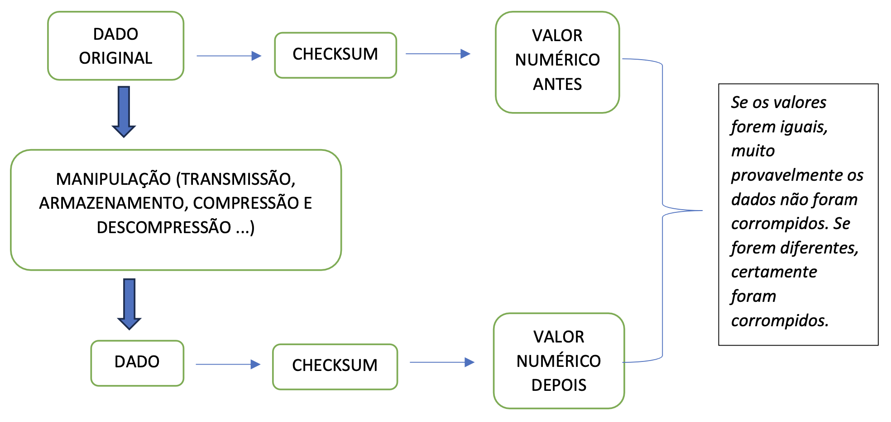

# Introdução ao Checksum

Neste projeto, serão adicionadas novas funcionalidades ao protocolo em desenvolvimento, sendo uma delas o **checksum**.

O **checksum** (ou *soma de verificação*) é um valor numérico gerado a partir de um conjunto de dados, utilizado para verificar a **integridade** dessas informações.  
Esse valor é obtido por meio de uma função *hash* ou algoritmo matemático, resultando em um identificador único baseado no conteúdo original.  

Caso os dados sejam alterados, o checksum calculado será diferente, evidenciando que houve modificação, seja ela **intencional** ou **acidental**.

No contexto de transmissão de dados, a função *hash* é aplicada aos dados originais, e o valor gerado é transmitido junto com eles.  
No lado receptor, a mesma função é aplicada novamente sobre os dados recebidos, e o valor obtido é comparado com o checksum enviado pelo transmissor.

---

## Como Funciona

1. **Geração do checksum:** um algoritmo específico (ex.: MD5, SHA-256, CRC32) processa os dados e gera um valor fixo.  
2. **Transmissão ou armazenamento:** o dado e seu checksum são enviados ou armazenados juntos.  
3. **Verificação:** o receptor recalcula o checksum a partir dos dados recebidos e compara com o original.  
   - Se os valores coincidirem, os dados provavelmente estão intactos.  
   - Se forem diferentes, houve alteração ou erro no processo.

---

## Aplicações Comuns

- **Verificação de integridade de arquivos:** validar se um arquivo baixado não foi corrompido.  
- **Transmissão de dados:** proteger contra erros em redes de comunicação.  
- **Segurança:** detectar alterações não autorizadas em arquivos.

---

---

## Principais Algoritmos

Diversos algoritmos podem ser utilizados como checksum, atribuindo um valor numérico a um conjunto de dados.  
A tabela a seguir apresenta alguns exemplos comuns:

| **Algoritmo** | **Bits (valor gerado)** | **Aplicação principal** |
|---------------|------------------------|-------------------------|
| CRC32         | 32                     | Redes, compressão de arquivos (ZIP, RAR) |
| MD5           | 128                    | Verificação de arquivos (obsoleto para fins de segurança) |
| SHA-1         | 160                    | Git, certificados digitais (inseguro para criptografia) |
| SHA-256       | 256                    | Segurança, Blockchain, SSL/TLS |
| BLAKE2        | 256+                   | Alternativa rápida ao SHA-2 |
| Adler-32      | 32                     | Checksum simples (mais rápido que CRC32, porém menos seguro) |

