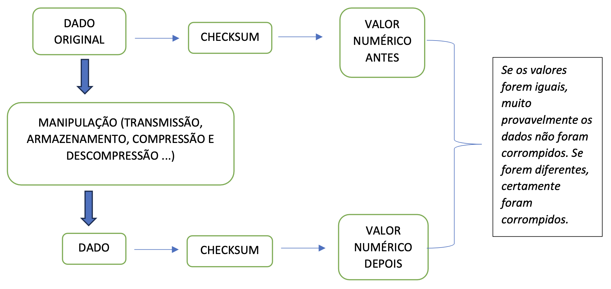

# Introdução ao Checksum

Neste projeto, serão adicionadas novas funcionalidades ao protocolo em desenvolvimento, sendo uma delas o **checksum**.

O **checksum** (ou *soma de verificação*) é um valor numérico gerado a partir de um conjunto de dados, utilizado para verificar a **integridade** dessas informações.  
Esse valor é obtido por meio de uma função *hash* ou algoritmo matemático, resultando em um identificador único baseado no conteúdo original.  

Caso os dados sejam alterados, o checksum calculado será diferente, evidenciando que houve modificação, seja ela **intencional** ou **acidental**.

No contexto de transmissão de dados, a função *hash* é aplicada aos dados originais, e o valor gerado é transmitido junto com eles.  
No lado receptor, a mesma função é aplicada novamente sobre os dados recebidos, e o valor obtido é comparado com o checksum enviado pelo transmissor.

> O checksum **não corrige** o erro, mas ajuda a **detectar** que algo saiu errado.

!!! exercise choice "Objetivo do Checksum"
    Qual é a principal função do checksum em um protocolo de comunicação?

    - [ ] Compactar os dados para reduzir o tamanho do pacote
    - [X] Detectar possíveis erros ou alterações nos dados transmitidos
    - [ ] Garantir criptografia ponta a ponta
    - [ ] Aumentar a velocidade de transmissão da rede

    !!! answer "Resposta!"
        O checksum é usado para detectar erros ou alterações nos dados transmitidos. Ele não criptografa, não comprime e não corrige automaticamente os erros.

---

## Como Funciona

1. **Geração do checksum:** um algoritmo específico (ex.: MD5, SHA-256, CRC32) processa os dados e gera um valor fixo.  
2. **Transmissão ou armazenamento:** o dado e seu checksum são enviados ou armazenados juntos.  
3. **Verificação:** o receptor recalcula o checksum a partir dos dados recebidos e compara com o original.  
   - Se os valores coincidirem, os dados provavelmente estão intactos.  
   - Se forem diferentes, houve alteração ou erro no processo.

De forma geral, o processo ocorre em quatro etapas:

### 1. O transmissor monta os dados
O transmissor prepara a mensagem ou o *payload* que será enviado.

### 2. O transmissor calcula o checksum
Um algoritmo é aplicado sobre os dados, gerando um valor numérico de verificação.

### 3. O pacote é enviado com os dados + checksum
Esse valor passa a fazer parte do pacote transmitido.

### 4. O receptor recalcula o checksum
Ao receber o pacote, o receptor executa o mesmo algoritmo sobre os dados recebidos e compara o resultado com o checksum enviado.

- ✅ Se os valores forem **iguais**, os dados são considerados válidos.
- ❌ Se os valores forem **diferentes**, o pacote é considerado corrompido.

## Aplicações Comuns

- **Verificação de integridade de arquivos:** validar se um arquivo baixado não foi corrompido.  
- **Transmissão de dados:** proteger contra erros em redes de comunicação.  
- **Segurança:** detectar alterações não autorizadas em arquivos.

!!! exercise choice "Verificação de Integridade"
    Considere um checksum simples obtido pela soma dos bytes. Se o transmissor enviou `5 10 15` com checksum `30`, e o receptor recebeu `5 10 14`, o que deve acontecer?

    - [ ] O pacote deve ser aceito, pois a diferença é pequena
    - [ ] O pacote deve ser corrigido automaticamente
    - [X] O pacote deve ser considerado inválido, pois o checksum recalculado será diferente
    - [ ] O checksum deve ser ignorado

    !!! answer "Resposta!"
        Como os dados recebidos mudaram, o checksum recalculado também muda. Isso indica erro na transmissão, e o pacote deve ser rejeitado ou tratado como inválido.

## Checksum, CRC e Hash: qual a diferença?

### Checksum
Termo mais geral para uma verificação numérica de integridade. Pode ser algo simples, como uma soma dos bytes, ou um cálculo mais específico definido pelo protocolo.

### CRC
O **CRC** (*Cyclic Redundancy Check*) é um método mais robusto de detecção de erro, muito usado em redes, arquivos compactados e protocolos embarcados. É mais eficaz que um checksum simples para detectar vários tipos de erro comuns.

### Hash criptográfico
Funções como **MD5**, **SHA-1** e **SHA-256** geram resumos dos dados, mas são mais associadas a integridade de arquivos, assinaturas digitais e segurança do que ao checksum clássico de protocolos simples.

> Didaticamente, todos podem ser vistos como formas de "gerar um valor a partir dos dados", mas tecnicamente têm **objetivos e robustez diferentes**.

## Principais Algoritmos

Diversos algoritmos podem ser utilizados como checksum, atribuindo um valor numérico a um conjunto de dados.  
A tabela a seguir apresenta alguns exemplos comuns:

| **Algoritmo** | **Bits (valor gerado)** | **Aplicação principal** |
|---------------|------------------------|-------------------------|
| CRC32         | 32                     | Redes, compressão de arquivos (ZIP, RAR) |
| MD5           | 128                    | Verificação de arquivos (obsoleto para fins de segurança) |
| SHA-1         | 160                    | Git, certificados digitais (inseguro para criptografia) |
| SHA-256       | 256                    | Segurança, Blockchain, SSL/TLS |
| BLAKE2        | 256+                   | Alternativa rápida ao SHA-2 |
| Adler-32      | 32                     | Checksum simples (mais rápido que CRC32, porém menos seguro) |

## Boas práticas ao implementar checksum no projeto

### 1. Definir claramente quais campos entram no cálculo
Os alunos precisam saber exatamente se o checksum cobre somente o payload, header + payload, ou o pacote inteiro.

### 2. Padronizar o tamanho do campo
Defina se o checksum ocupará **1 byte**, **2 bytes** ou mais.

### 3. Calcular sempre antes do envio
O checksum deve ser gerado com os dados finais do pacote, antes da transmissão.

### 4. Verificar imediatamente ao receber
Assim que o pacote chega, o receptor deve validar o checksum **antes** de aceitar os dados.

### 5. Tratar erro de forma explícita
Se o checksum falhar, o protocolo deve:

- Descartar o pacote;
- Solicitar reenvio;
- Ou sinalizar erro de recepção.

---