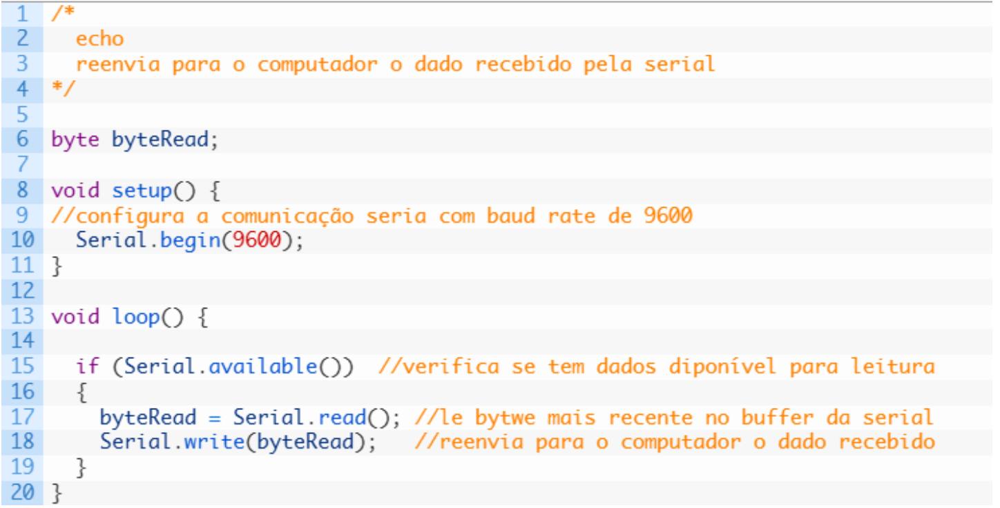
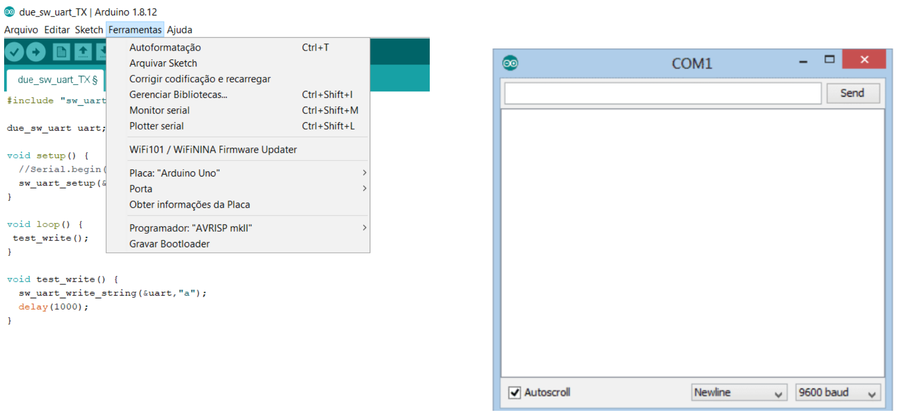
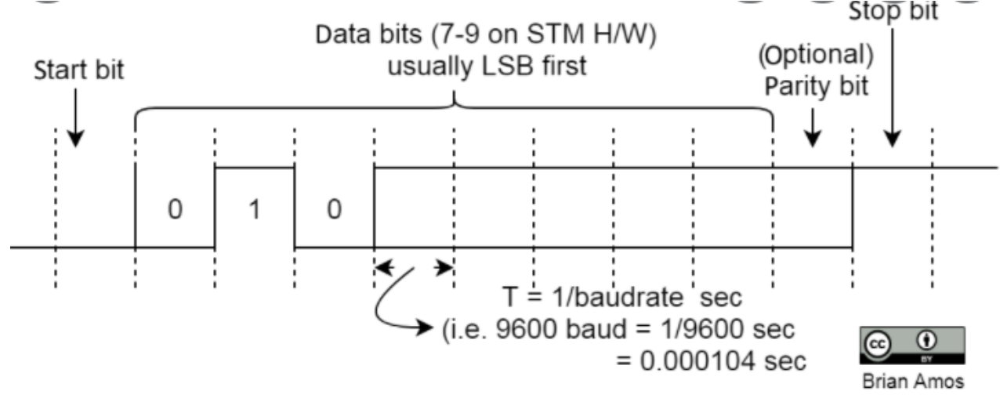
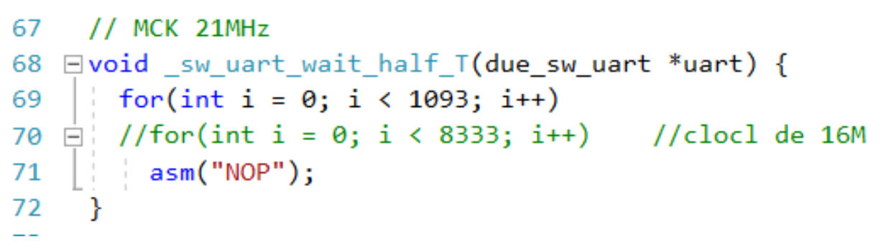
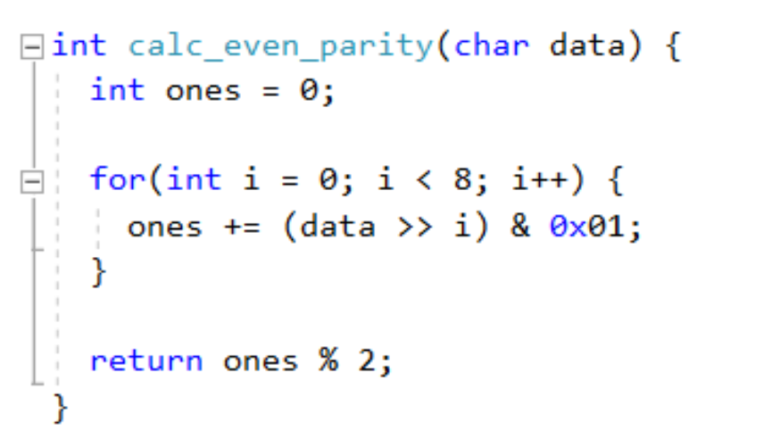
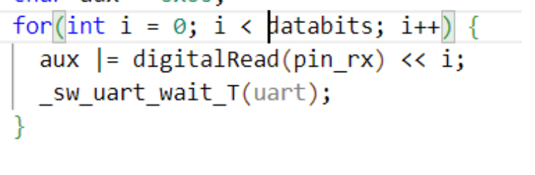

## Serialização de dados

Quando seu computador se comunica com seu Arduino, mensagens seriais são trocadas entre eles. Isso ocorre quando você está carregando o Arduino com algum código e também quando você quer monitorar o valor de alguma variável do código rodando no Arduino. Para fazer essa monitoração o código carregado no Arduino deve conter uma declaração de comunicação serial e comandos de envio de valores. No seu computador, na IDE, você pode então observar e até plotar o valor dessa variável. Veja o exemplo abaixo:

Neste exemplo foi utilizada a função `Serial.available()`para verificar se há dado disponível no buffer da serial. Quando há um byte para leitura, o mesmo é lido pela função `Serial.read()` e armazenado na variavel byteRead. A próxima função, `Serial.write()`, imprime de volta o dado recebido para o computador. Para acessar o valor enviado, em seu IDE você deve abrir o terminal `monitor serial` e configurar o baudrate.

Nesse projeto, você deve utilizar a comunicação serial entre Arduino e computador para monitorar variáveis, porém, faremos uma outra comunicação serial, entre dois Arduinos, utilizando **pinos digitais genéricos ao invés dos pinos próprios para transmissões UART (RX e TX)!** Isso significa que para cada byte enviado de um Arduino para outro voce terá que produzir o frame UART relativo ao byte e receber esse byte no outro Arduino. Você poderá
utilizar a comunicação serial “built in” do Arduino apenas para verificar se o byte trocado entre os dois microcontroladores foi recebido corretamente. 

Em outras palavras, o objetivo desse projeto é te `desafiar` a produzir a serialização de um byte e enviá-lo através de um pino digital qualquer de um Arduino para outro Arduino, que receberá a mensagens no padrão UART através de outro pino digital qualquer. Obviamente você não poderá usar os pinos 𝑡𝑥 e 𝑟𝑥 dos Arduinos (esses pinos são os que também estão conectados ao computados através do cabo). 

A ideia é que você construa um algoritmo que produza a saída UART em um pino digital genérico. Para isso, você deverá codificar o caractere através da tabela ASCII e enviar os bits de acordo com frame UART com 1 bit de paridade, 1 start, 1 stop bit e um certo 𝑏𝑎𝑢𝑑𝑟𝑎𝑡𝑒. No arduino que receberá o byte enviado, você poderá observar se o recebimento ocorreu através do monitor serial do Arduino receptor.

## Lembre-se de como funciona o 𝑓𝑟𝑎𝑚𝑖𝑛𝑔 da comunicação UART:

Você deve gerar um código que produza num pino do Arduino a serialização correta de um frame UART respeitando os tempos corretos entre os bits. Se fizer tudo corretamente, seu caractere será transmitido via transmissão serial UART e você não estará usando o chip UART do Arduino!

### Programando em Arduino

Você precisará aprender, caso não saiba, como:

- Definir pinos digitais de escrita e leitura no arduino.
- Habilitar a saída serial para monitoramento de uma variável.
- Como construir um byte representando o caractere, a partir de leitura de cada bit! Para isso, pesquise e entenda o funcionamento dos operadores “<<” (left shift) e também do |= (compound bitwise or)
- Como produzir cada bit na saída digital a partir de leitura de um byte! Para isso, pesquise e entenda o
funcionamento dos operadores “>>” (right shift) e também do & (compound bitwise and) .
- Não se esqueça que a leitura dos níveis lógicos no receptor não pode ser feitas nos instantes de transição do nível lógico (como comentado em aula).
- Escrever esse caractere na saída serial.

Caso você ainda não tenha tido experiência de programação em Arduino, procure tutoriais para os primeiros passos, como por exemplo:

- [https://www.circuitar.com.br/tutoriais/programacao-para-arduino-primeiros-passos/](https://www.circuitar.com.br/tutoriais/programacao-para-arduino-primeiros-passos/)
- [https://www.makerhero.com/blog/primeiros-passos-com-arduino/](https://www.makerhero.com/blog/primeiros-passos-com-arduino/)
- [https://www.arduino.cc/reference/pt/language/functions/digital-io/digitalwrite/](https://www.arduino.cc/reference/pt/language/functions/digital-io/digitalwrite/)
- [https://www.arduino.cc/reference/pt/language/functions/digital-io/digitalread/](https://www.arduino.cc/reference/pt/language/functions/digital-io/digitalread/)

## Exemplos de códigos

### Função de espera

Você poderá fazer a função espera utilizando loop com a função de `asm(“NOP”)`

Se utilizar essa estratégia de timer, você deve descobrir antes, quanto tempo o Arduino leva por loop!!! Sinta-se livre para utilizar outras funções ou estratégias de espera, lembrando para transmissões mais velozes funções como delay podem não ser precisas o suficiente.

### Cálculo de paridade

Você poderá utilizar funções para calcular a paridade baseadas em bit shift e o operador and:

### Montando o byte recebido:

Você deverá usar a estratégia de bit shift e o operador or para compor o byte recebido.

### Escrita no monitor serial para conferência

Utilize a saída serial do Arduino conectada ao seu computador para printar a variável recebida.

## Montagem

Você precisará de 2 Arduinos. Um deles irá funcionar como o transmissor de um caractere qualquer, em loop, utilizando para isso o padrão UART. Você deverá entao conectar um dos pinos digitais de um Arduino a outro pino digital do segundo Arduino. Não esqueça de que agora os botões resetes não deverão mais estar aterrados, pois você estará usando o processador do Arduino. Lembre-se também de que voce terá de conectar os terras dos
dispositivo.

## Analog Discovery

Você deverá utilizar o Wave Forms para analisar a transmissão. Para isso, você irá conectar uma das entradas digitais do Analog Discovery ao pino que está produzindo o sinal UART. No menu do software Wave Forms você irá selecionar o analisador lógico e configurar um canal UART. Você poderá observar então, ao configurar uma escala de tempo adequada, os bits que compõem o frame UART e o caractere transmitido!

Link de ajuda: [https://digilent.com/blog/uart-explained/](https://digilent.com/blog/uart-explained/)
