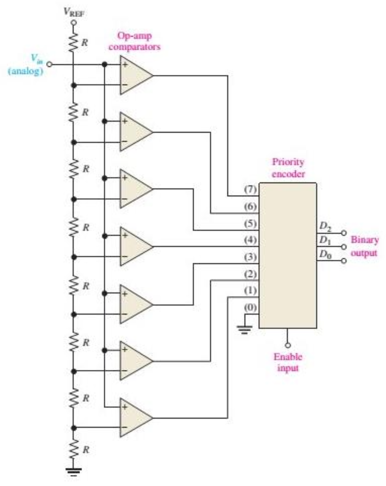

# Digitalização  

## O Mundo Analógico e a Digitalização

Embora dependentes dos equipamentos digitais, vivemos num mundo de grandezas analógicas. As grandezas físicas no nosso mundo são analógicas, como temperatura, pressão, velocidade, massa etc. Isso quer dizer que essas grandezas apresentam valores contínuos no tempo, podendo apresentar qualquer valor dentro de qualquer intervalo. Pense, por exemplo, na temperatura do ambiente em que você está. Existe algum valor impossível para a temperatura no intervalo, por exemplo, entre 10 e 30 graus? A resposta é não. A temperatura de um ponto pode variar continuamente ocupando qualquer valor pertencente a esse intervalo. Porém, se quisermos digitalizar o valor da temperatura, guardando o histórico de temperatura de um ponto em um computador, não teremos mais infinitos possíveis valores. Teríamos que fazer algumas amostras da temperatura (como e fossem fotos) e guardá-las em uma variável de n-bits. Assim, ao se digitalizar uma grandeza física que varie no tempo, temos duas perdas:  

1. Não podemos ter o valor registrado em todos os instantes, pois seriam infinitas amostras.  
2. Ao fazer uma amostra, temos que aproximar o valor ao valor mais próximo que podemos escrever com os n bits que utilizamos para registrar a amostra. Essa aproximação é chamada de **quantização**.  

A variável física, contínua por natureza, torna-se uma série de amostras. Dizemos que a variável deixou de ser contínua e passou a ser discreta. A digitalização de uma variável é um processo de discretização da variável. O mundo digital é discreto, ou seja, as variáveis possuem valores quantizados (aproximados a níveis possíveis) e com quantidade finita de amostras (representam um número limitado de instantes).  

No gráfico acima, o gráfico senoidal representa uma variável contínua. Os pontos redondos representam os valores amostrados no processo de digitalização. Os pontos quadrados são os valores de fato armazenados em variáveis de n bits, com as quais não é possível escrever qualquer valor.  

Durante o processo de digitalização, dá-se o nome de **taxa (ou frequência) de amostragem** à quantidade de amostras que é feita por segundo. **Período de amostragem** é o nome dado ao tempo decorrido entre duas amostras consecutivas.  

Quanto menor forem os erros de quantização numa conversão analógico-digital, dizemos que melhor é a **resolução** da digitalização. Assim, para uma digitalização ser feita com boa resolução, as amostras devem ser feitas e guardadas em variáveis com um bom número de bits. Por outro lado, a resolução pode também ser melhorada, se o intervalo do sinal analógico for reduzido, assim os possíveis valores que podem ser guardados com o n bits das variáveis serão distribuídos em um intervalo pequeno, diminuindo a diferença entre dois valores possíveis consecutivos. Iremos voltar a falar disso.  

De maneira resumida, o processo de digitalização então envolve as 3 seguintes etapas:  

1. **Amostragem (Sampling):**  
   - O sinal analógico é medido em intervalos regulares de tempo (frequência de amostragem).  
   - Isso gera uma série de amostras pontuais do sinal contínuo.  

2. **Quantização (Quantization):**  
   - Cada amostra é arredondada para o valor mais próximo dentro de um conjunto finito de níveis discretos.  
   - Isso introduz um pequeno erro chamado **erro de quantização**.  

3. **Codificação (Encoding):**  
   - Os valores quantizados são convertidos em códigos binários (0s e 1s).  
   - O número de bits usados determina a resolução do conversor. Por exemplo:  
     - Um ADC de 8 bits pode representar 2⁸ = 256 níveis diferentes.  
     - Um ADC de 12 bits pode representar 4096 níveis, e assim por diante.  

## Exemplo: Digitalização de Áudio

Vamos construir um exemplo baseado na digitalização do som. O que chamamos de som é uma perturbação no ar devido à vibração mecânica de um corpo. Essa vibração causa uma variação da pressão dos pontos do ar, que, devido à sua característica elástica, propaga essa perturbação. Assim tem-se no meio elástico (ar) uma variação na pressão, correspondente à vibração do corpo que produziu a perturbação. É exatamente o que faz um alto-falante ou nosso corpo quando falamos. Quando a variação de pressão atinge nosso ouvido, uma complexa estrutura produz impulsos elétricos para nosso cérebro nos dando a sensação auditiva. Nosso ouvido converte uma grandeza analógica mecânica para uma grandeza analógica elétrica. Estruturas que fazem isso são chamadas de **transdutores**.  

Porém, o som pode ser digitalizado e guardado em nossos computadores, celulares etc.? Assim como nosso ouvido, precisamos antes transformar a grandeza mecânica (pressão) em grandeza elétrica (força eletromotriz e, consequentemente, corrente) através de um transdutor, chamado **microfone**. O microfone transforma a variação de pressão ao seu redor em um campo elétrico que varia no tempo de forma correspondente à variação da pressão. Há vários tipos de microfones, sendo talvez o mais comum o de **bobina móvel**. Esse tipo de microfone possui uma leve bobina acoplada a um diafragma que vibra quando exposto ao som. A vibração faz com que a bobina, que está num campo magnético, também vibre e tenha então o fluxo magnético variando no tempo. Bem, esse fluxo variando no tempo dá origem a uma força eletromotriz correspondente à vibração mecânica.  

Agora temos o som “representado” por uma força eletromotriz. O próximo passo é, através de um hardware
próprio (falaremos mais tarde) amostrar essa força e guardar os valores em variáveis de n bits. Se fizermos isso, digitalizaremos o som.  

Vamos fazer algumas considerações:  

- A amostragem será feita a uma frequência de **44,1 kHz**. Essa taxa é a que normalmente é utilizada por placas de áudio, algumas utilizam **48 kHz**.  
- Normalmente a amostra é feita em dois canais, sendo **estéreo**. Isso significa que os equipamentos utilizam dois microfones. Assim, duas listas de valores são arquivadas. Tudo é feito duplamente. Isso permite muitas vezes gerar uma sensação de **espacialidade** para o som gravado.  
- Cada amostra realizada no processo de digitalização é guardada em uma variável de **16 bits**.  

Com essas considerações vamos tentar responder as seguintes perguntas:  

!!! exercise
    Quanto de memória computacional é necessário para gravarmos em um computador 1 hora de áudio
   estéreo?  

## Hardware A/D

Existem vários tipos de hardwares para converter um sinal analógico em digital. Um tipo muito rápido, e comumente utilizado, é construído com um **banco de comparadores**, que são na verdade amplificadores operacionais. 
Repare o circuito abaixo. À medida que o sinal analógico cresce, sequencialmente os amplificadores operacionais mudam sua saída, pois em cada um há um sinal de referência diferente. Esse sinal de referência que vai crescendo em cada amp op é construído com um divisor resistivo. Um encoder reproduz em base 2 o número de amplificadores em estado alterado, ou seja, o nível do sinal analógico.  

## Exercícios

!!! exercise
    1. Um sinal de **eletrocardiograma (ECG)** de 5 minutos necessita ser enviado por um enlace de comunicação que consegue transmitir dados a um **baudrate de 1000 bps** porém possui um **overhead de 10%**. O ECG é amostrado a uma taxa de **1 kHz** e possui resolução de **14 bits**.
    **Em quantos minutos o ECG será transmitido aproximadamente?**

---

!!! exercise
    2. Um sinal proveniente de um **captador de guitarra elétrica** deve ser digitalizado.
    O "range" do sinal é de **–50 a +50 mV**. Deseja-se uma resolução de, no mínimo, **10 microvolts**. **Quantos bits, no mínimo, serão necessários por amostra?**

---

!!! exercise
    3. Um sinal de áudio **senoidal de 4400 Hz** foi digitalizado e armazenado com um **Ts (período de amostragem)** de **25 microssegundos** (entenda o período de amostragem como o tempo entre duas amostras, ou seja, o inverso da taxa de amostragem). Posteriormente foi reproduzido (convertido de digital para analógico) com uma **frequência de amostragem (sample rate)** de **80000 Hz**. **Nesse caso, qual a frequência da senoide analógica ouvida?**