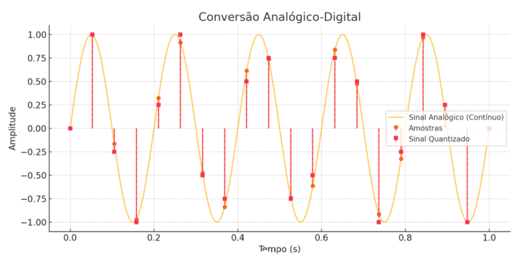
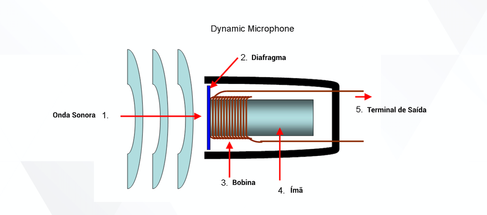
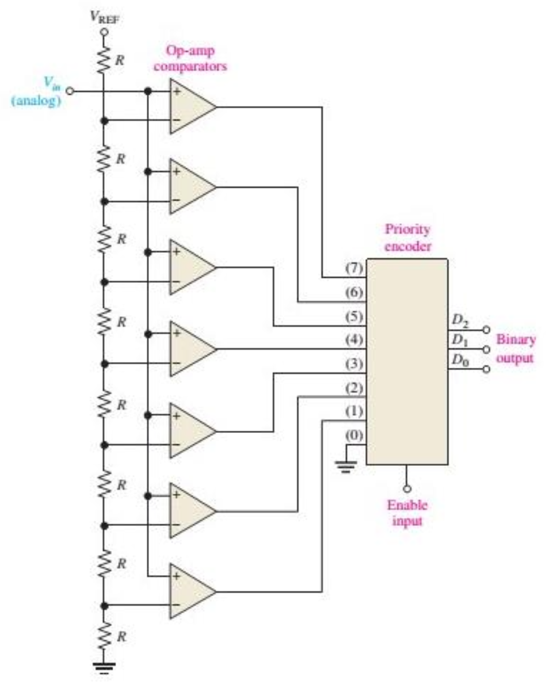

# Digitalização

## Contexto Global da Digitalização

Vivemos cercados por dispositivos digitais: celulares, computadores, microcontroladores, placas de aquisição, sensores inteligentes, sistemas embarcados e equipamentos médicos. Apesar disso, o mundo físico ao nosso redor não é digital. Temperatura, pressão, luminosidade, velocidade, massa, som e tensão elétrica são exemplos de grandezas que variam de maneira **contínua**.

Quando um sistema computacional precisa medir, armazenar, transmitir ou processar essas grandezas, surge um problema fundamental: computadores trabalham com valores **discretos** e finitos, enquanto o mundo físico se comporta, em geral, de forma **analógica**.

A **digitalização** é justamente o processo que permite transformar uma grandeza analógica em uma representação digital, adequada para armazenamento, processamento e comunicação em sistemas computacionais.

## O Mundo Analógico e a Digitalização

As grandezas físicas do mundo real são, em sua maioria, analógicas. Isso significa que podem assumir qualquer valor dentro de um intervalo contínuo.

Pense, por exemplo, na temperatura de uma sala. Entre 10 °C e 30 °C, não existem apenas alguns valores possíveis. Em teoria, qualquer valor nesse intervalo pode ocorrer: 18 °C, 18,5 °C, 18,53 °C, 18,531 °C e assim por diante.

Entretanto, se desejarmos registrar essa temperatura em um computador, não conseguiremos armazenar uma quantidade infinita de valores nem acompanhar todos os instantes do tempo continuamente. Para isso, precisamos transformar essa variação contínua em uma sequência finita de valores digitais.

Esse processo envolve duas limitações fundamentais:

1. **Não é possível registrar o valor em todos os instantes do tempo**, pois isso exigiria infinitas amostras.
2. **Cada valor medido precisa ser aproximado** para um dos níveis que podem ser representados com uma quantidade finita de bits.

Essa aproximação recebe o nome de **quantização**.

Assim, uma variável contínua passa a ser representada por uma sequência de amostras discretas. Dizemos, então, que houve uma **discretização** da variável.

No gráfico acima:

- a curva senoidal representa o **sinal analógico contínuo**;
- os pontos redondos representam as **amostras coletadas**;
- os pontos quadrados representam os **valores quantizados**, isto é, os valores efetivamente armazenados em variáveis digitais de `n` bits.

## Perdas Envolvidas no Processo de Digitalização

Ao digitalizar uma grandeza analógica, sempre ocorre algum nível de perda de informação. Isso acontece porque a representação digital nunca é uma cópia perfeita do sinal contínuo original.

As duas perdas principais são:

### 1. Perda temporal
Como a medição acontece em instantes discretos, o sistema deixa de conhecer o comportamento exato do sinal entre duas amostras consecutivas.

### 2. Perda por quantização
Mesmo no instante em que a amostra é coletada, o valor obtido precisa ser aproximado para um nível representável digitalmente.

Essas perdas são inerentes ao processo de conversão analógico-digital e estão diretamente relacionadas à qualidade da digitalização.

!!! exercise
    Explique, com suas palavras, por que a digitalização de uma grandeza analógica sempre implica perda de informação. Em sua resposta, diferencie:
    
    1. a perda associada ao tempo;
    2. a perda associada aos níveis de representação.

!!! exercise choice "Grandezas Analógicas e Digitais"
    Qual alternativa descreve corretamente a principal diferença entre uma grandeza analógica e uma grandeza digital?

    - [ ] A grandeza analógica assume apenas valores inteiros, enquanto a digital assume valores reais.
    - [X] A grandeza analógica varia continuamente, enquanto a digital é representada por valores discretos.
    - [ ] A grandeza digital é sempre mais precisa que a analógica.
    - [ ] A grandeza analógica não pode ser medida por sensores.

    !!! answer "Resposta!"
        Grandezas analógicas podem assumir qualquer valor dentro de um intervalo, variando continuamente no tempo. Já as grandezas digitais são representadas por um conjunto finito de valores discretos.

## Etapas da Digitalização

De forma resumida, o processo de digitalização pode ser entendido em três etapas principais.

### 1. Amostragem (Sampling)

O sinal analógico é observado em instantes regulares de tempo. Em vez de registrar todos os instantes possíveis, o sistema coleta apenas alguns valores pontuais.

A quantidade de amostras realizadas por segundo é chamada de **frequência de amostragem** ou **taxa de amostragem**.

O intervalo de tempo entre duas amostras consecutivas é chamado de **período de amostragem**.

A relação entre essas duas grandezas é:

$$
f_s = \frac{1}{T_s}
$$

Onde:

- $ f_s $ = frequência de amostragem
- $ T_s $ = período de amostragem

### 2. Quantização (Quantization)

Depois de coletada, cada amostra precisa ser ajustada para um dos níveis possíveis de representação.

Como só existe um número finito de níveis disponíveis, o valor real é aproximado para o nível mais próximo. Essa diferença gera o chamado **erro de quantização**.

### 3. Codificação (Encoding)

Por fim, o valor quantizado é transformado em uma sequência binária de 0s e 1s. Essa etapa torna possível armazenar ou transmitir a informação digitalmente.

O número de bits usados na codificação define quantos níveis podem ser representados:

- 8 bits → $2^8 = 256$ níveis
- 10 bits → $2^{10} = 1024$ níveis
- 12 bits → $2^{12} = 4096$ níveis
- 16 bits → $2^{16} = 65536$ níveis

!!! exercise choice "Etapas da Digitalização"
    Em qual etapa da digitalização ocorre o arredondamento de um valor analógico para um nível discreto representável?

    - [ ] Amostragem
    - [X] Quantização
    - [ ] Codificação
    - [ ] Modulação

    !!! answer "Resposta!"
        A quantização é a etapa em que cada amostra do sinal é aproximada para um valor pertencente a um conjunto finito de níveis possíveis de representação.

## Taxa de Amostragem e Período de Amostragem

A qualidade com que o comportamento temporal de um sinal é capturado depende diretamente da frequência de amostragem.

### Definições importantes

| Conceito | Definição |
|----------|-----------|
| **Taxa de amostragem** | Número de amostras coletadas por segundo |
| **Período de amostragem** | Tempo entre duas amostras consecutivas |

### Relação entre as grandezas

Se um sinal é amostrado a:

- **1000 Hz**, então o sistema coleta **1000 amostras por segundo**
- o período de amostragem será:

$$
T_s = \frac{1}{1000} = 0,001 \text{ s} = 1 \text{ ms}
$$

Quanto maior a taxa de amostragem, mais fiel tende a ser a representação temporal do sinal.

!!! warning "Importante"
    Aumentar a taxa de amostragem melhora a representação temporal do sinal, mas também aumenta a quantidade de dados gerados, exigindo mais memória, mais largura de banda e maior capacidade de processamento.

## Resolução e Quantização

Outro aspecto fundamental da digitalização é a **resolução**.

A resolução está relacionada à quantidade de níveis disponíveis para representar o sinal. Quanto maior o número de bits usados por amostra, menor tende a ser a diferença entre dois níveis consecutivos, e menor tende a ser o erro de quantização.

Imagine que queremos digitalizar um sinal no intervalo de 0 a 5 V.

- Com **8 bits**, temos 256 níveis possíveis.
- Com **10 bits**, temos 1024 níveis possíveis.
- Com **12 bits**, temos 4096 níveis possíveis.

Logo, com mais bits, os níveis ficam mais “próximos” uns dos outros, permitindo uma representação mais precisa do sinal.

De forma simplificada, o tamanho do menor incremento representável pode ser estimado por:

$$
\Delta = \frac{V_{max} - V_{min}}{2^n}
$$

Onde:

- $ \Delta $ = passo de quantização
- $ n $ = número de bits
- $ V_{max} - V_{min} $ = faixa do sinal

Quanto menor for esse passo, melhor a resolução.

!!! exercise choice "Resolução"
    Um conversor A/D de 12 bits possui quantos níveis de quantização?

    - [ ] 256
    - [ ] 1024
    - [X] 4096
    - [ ] 8192

    !!! answer "Resposta!"
        Um conversor de 12 bits pode representar $2^{12} = 4096$ níveis discretos.

## Exemplo: Digitalização de Áudio

Um dos exemplos mais conhecidos de digitalização é o som.

O som é uma perturbação mecânica no ar que provoca variações de pressão ao longo do tempo. Quando essa variação atinge o ouvido humano, estruturas biológicas convertem essa grandeza mecânica em impulsos elétricos que são interpretados pelo cérebro como sensação auditiva.

Para digitalizar o som, primeiro é necessário converter essa variação de pressão em um sinal elétrico. Essa tarefa é realizada por um **transdutor**, que nesse caso é o **microfone**.

### Transdutores

Transdutores são dispositivos capazes de transformar uma forma de energia em outra.

No caso do microfone:

- a entrada é uma grandeza **mecânica** associada à pressão sonora;
- a saída é uma grandeza **elétrica**, tipicamente uma tensão que varia no tempo.

Um microfone de bobina móvel possui:

- um **diafragma**, que vibra com a pressão sonora;
- uma **bobina**, acoplada ao diafragma;
- um **campo magnético**, no qual essa bobina se move.

Quando a bobina vibra dentro do campo magnético, surge uma força eletromotriz variável no tempo, correspondente ao som captado.

A partir daí, esse sinal elétrico pode ser amostrado, quantizado e codificado.

## Exemplo Numérico: 1 Hora de Áudio Estéreo

Considere um sistema de digitalização de áudio com as seguintes características:

- frequência de amostragem: **44,1 kHz**
- número de canais: **2** (estéreo)
- resolução: **16 bits por amostra**
- duração: **1 hora**

Queremos calcular quanto de memória é necessário para armazenar esse áudio.

### Passo 1: número de amostras por segundo

Como são dois canais:

$$
44100 \times 2 = 88200 \text{ amostras por segundo}
$$

### Passo 2: quantidade de bits por segundo

Cada amostra possui 16 bits:

$$
88200 \times 16 = 1.411.200 \text{ bits por segundo}
$$

### Passo 3: converter para bytes por segundo

$$
\frac{1.411.200}{8} = 176.400 \text{ bytes por segundo}
$$

### Passo 4: calcular para 1 hora

$$
176.400 \times 3600 = 635.040.000 \text{ bytes}
$$

Isso equivale aproximadamente a:

- **635 MB** em base decimal
- ou cerca de **606 MiB** em base binária

!!! exercise
    Quanto de memória computacional é necessário para gravarmos em um computador 1 hora de áudio estéreo com:
    
    - taxa de amostragem de 44,1 kHz;
    - resolução de 16 bits por amostra;
    - dois canais?
    
    Apresente o cálculo completo.

    !!! answer "Resposta!"
        Para cada segundo:
        
        - 44.100 amostras por segundo por canal
        - 2 canais → 88.200 amostras por segundo
        - cada amostra tem 16 bits
        
        Então:
        
        $$
        88.200 \times 16 = 1.411.200 \text{ bits/s}
        $$
        
        Convertendo para bytes:
        
        $$
        \frac{1.411.200}{8} = 176.400 \text{ bytes/s}
        $$
        
        Em 1 hora:
        
        $$
        176.400 \times 3600 = 635.040.000 \text{ bytes}
        $$
        
        Aproximadamente, isso corresponde a 635 MB.

---

## Taxa de Dados em Sinais Digitalizados

Sempre que um sinal é digitalizado, ele passa a produzir uma taxa de dados que depende de três fatores principais:

$$
\text{Taxa de bits} = f_s \times n \times C
$$

Onde:

- $ f_s $ = frequência de amostragem
- $ n $ = número de bits por amostra
- $ C $ = número de canais

Essa fórmula é extremamente importante em sistemas digitais, pois permite estimar:

- necessidade de memória;
- largura de banda de transmissão;
- capacidade de armazenamento;
- desempenho do sistema.

### Exemplo

Um sinal mono, digitalizado com:

- $ f_s = 1000 $ Hz
- $ n = 14 $ bits
- $ C = 1 $

gera:

$$
1000 \times 14 = 14.000 \text{ bits/s}
$$

---

## Hardware A/D

A digitalização de sinais analógicos exige a presença de um circuito eletrônico específico chamado **conversor analógico-digital** ou **ADC (Analog-to-Digital Converter)**.

Existem diversas arquiteturas de ADC, cada uma com características próprias de velocidade, custo, precisão e complexidade.

Uma arquitetura clássica e conceitualmente muito importante é aquela baseada em um **banco de comparadores**.

### Funcionamento geral

Nesse tipo de conversor:

1. o sinal analógico é aplicado a vários comparadores;
2. cada comparador possui uma tensão de referência diferente;
3. à medida que o sinal cresce, mais comparadores mudam de estado;
4. um **encoder** interpreta esse padrão e produz a saída binária correspondente ao nível detectado.

### Intuição física

Esse tipo de circuito funciona como uma “escada de decisão”:

- se o sinal ultrapassa a primeira referência, um comparador ativa;
- se ultrapassa a segunda, outro ativa;
- e assim por diante.

Ao final, o encoder transforma a quantidade de níveis atingidos em um número binário.

### Vantagem principal
- alta velocidade de conversão

### Limitação principal
- exige muitos comparadores para resoluções maiores

Por isso, embora seja muito rápido, esse tipo de arquitetura pode se tornar caro e complexo para conversores com muitos bits.

## Relação entre Resolução e Faixa do Sinal

A resolução não depende apenas do número de bits. Ela também está ligada à faixa de valores que o sinal pode assumir.

Se um mesmo número de níveis digitais for distribuído em um intervalo muito grande, a distância entre dois níveis consecutivos será maior. Se esse intervalo for reduzido, a distância entre níveis diminui, melhorando a sensibilidade da representação.

### Exemplo conceitual

Considere dois conversores de 10 bits:

- Conversor A: faixa de 0 a 10 V
- Conversor B: faixa de 0 a 1 V

Ambos têm $2^{10} = 1024$ níveis, mas no segundo caso os níveis estão distribuídos em uma faixa menor, o que reduz o passo de quantização.

Isso significa que, para uma mesma quantidade de bits, um sinal com faixa menor pode ser digitalizado com melhor detalhamento.

---

## Aplicações da Digitalização

A digitalização está presente em praticamente todos os sistemas modernos.

### Exemplos de aplicação

| Aplicação | Grandeza analógica | Forma digitalizada |
|----------|--------------------|--------------------|
| Áudio | Pressão sonora | Amostras de tensão |
| ECG | Potencial elétrico do corpo | Sequência digital de amostras |
| Sensor de temperatura | Tensão proporcional à temperatura | Valores digitais em registradores |
| Imagem digital | Intensidade luminosa | Pixels quantizados |
| Acelerômetro | Aceleração | Amostras digitais por eixo |

A compreensão desse processo é fundamental em eletrônica, sistemas embarcados, telecomunicações, instrumentação e processamento digital de sinais.

!!! exercise choice "Hardware A/D"
    Em um conversor A/D baseado em banco de comparadores, o encoder tem como principal função:

    - [ ] gerar o sinal analógico de entrada
    - [ ] reduzir a frequência de amostragem
    - [X] converter o estado dos comparadores em uma palavra binária
    - [ ] amplificar o sinal digital de saída

    !!! answer "Resposta!"
        O encoder observa quais comparadores mudaram de estado e transforma essa informação em um número binário correspondente ao nível do sinal analógico.

## Exercícios

!!! exercise
    1. Um sinal de **eletrocardiograma (ECG)** de 5 minutos necessita ser enviado por um enlace de comunicação que consegue transmitir dados a um **baudrate de 1000 bps**, porém possui um **overhead de 10%**. O ECG é amostrado a uma taxa de **1 kHz** e possui resolução de **14 bits**.
    
    **Em quantos minutos o ECG será transmitido aproximadamente?**

    !!! answer "Resposta!"
        Primeiro, calculamos a quantidade total de dados do ECG.
        
        Duração do sinal:
        
        $$
        5 \text{ min} = 300 \text{ s}
        $$
        
        Taxa de geração de dados:
        
        $$
        1000 \text{ amostras/s} \times 14 \text{ bits} = 14.000 \text{ bits/s}
        $$
        
        Total de bits:
        
        $$
        14.000 \times 300 = 4.200.000 \text{ bits}
        $$
        
        O enlace tem 1000 bps com overhead de 10%, portanto a taxa útil é:
        
        $$
        1000 \times 0,9 = 900 \text{ bps}
        $$
        
        Tempo de transmissão:
        
        $$
        \frac{4.200.000}{900} \approx 4666,67 \text{ s}
        $$
        
        Convertendo para minutos:
        
        $$
        \frac{4666,67}{60} \approx 77,8 \text{ min}
        $$
        
        Portanto, a transmissão levará aproximadamente **78 minutos**.

---

!!! exercise
    2. Um sinal proveniente de um **captador de guitarra elétrica** deve ser digitalizado.
    O intervalo do sinal é de **–50 a +50 mV**. Deseja-se uma resolução de, no mínimo, **10 microvolts**.
    
    **Quantos bits, no mínimo, serão necessários por amostra?**

    !!! answer "Resposta!"
        A faixa total do sinal é:
        
        $$
        50 - (-50) = 100 \text{ mV} = 100.000 \text{ microvolts}
        $$
        
        Se queremos resolução de 10 microvolts, então precisamos de pelo menos:
        
        $$
        \frac{100.000}{10} = 10.000 \text{ níveis}
        $$
        
        Agora buscamos o menor número de bits tal que:
        
        $$
        2^n \geq 10.000
        $$
        
        Testando:
        
        - $2^{13} = 8192$
        - $2^{14} = 16384$
        
        Logo, o menor valor que atende é:
        
        $$
        n = 14
        $$
        
        Portanto, serão necessários **14 bits por amostra**.

---

!!! exercise
    3. Um sinal de áudio **senoidal de 4400 Hz** foi digitalizado e armazenado com um **período de amostragem** $T_s$ de **25 microssegundos**. Posteriormente, esse sinal foi reproduzido com uma **frequência de amostragem** de **80000 Hz**.
    
    **Qual será a frequência da senoide analógica ouvida na reprodução?**

    !!! answer "Resposta!"
        Primeiro, calculamos a frequência de amostragem usada na digitalização:
        
        $$
        f_s = \frac{1}{T_s} = \frac{1}{25 \times 10^{-6}} = 40.000 \text{ Hz}
        $$
        
        Ou seja, o sinal foi originalmente amostrado a **40 kHz**.
        
        A senoide original tem 4400 Hz. Em termos de amostras, sua frequência normalizada ficou preservada no arquivo digital.
        
        Se o áudio for reproduzido usando 80.000 Hz em vez de 40.000 Hz, a reprodução ocorrerá com velocidade dobrada.
        
        Assim, a frequência ouvida também será dobrada:
        
        $$
        4400 \times \frac{80000}{40000} = 8800 \text{ Hz}
        $$
        
        Portanto, a frequência ouvida será **8800 Hz**.
