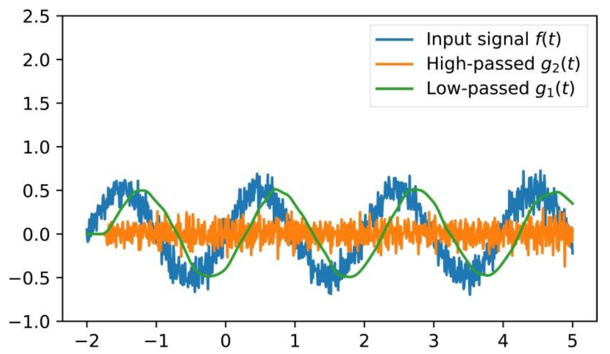

# Projeto 7 – Filtros Digitais (Equalizador Digital de Áudio)

Um **filtro digital** é um sistema que processa **sinais digitais** com o objetivo de **modificar ou extrair certas características** do sinal, como remover ruído, destacar uma faixa de frequências ou limitar a largura de banda.  

Ele atua sobre uma sequência de amostras (valores discretos no tempo do sinal digitalizado) e produz uma nova sequência como resultado.

Sabemos que um sinal pode ser decomposto em muitas senoides, de diversas frequências, certo?  
Um filtro digital pode então ser visto como uma **“peneira”** que deixa passar apenas certas frequências que compõem o sinal (por exemplo, **graves ou agudos**) e bloqueia o resto.

## Tipos de Filtros Digitais

Adotando como critério as frequências que um filtro **bloqueia** e as que **mantém** ou **amplifica**, categorizamos os filtros digitais em quatro tipos principais:

### 🔹 Filtro Passa-Baixa (*Low Pass Filter*)
Elimina as frequências que compõem o sinal e que estejam **acima** de um dado limite denominado **frequência de corte** (𝑓₍corte₎).

### 🔹 Filtro Passa-Alta (*High Pass Filter*)
Elimina as frequências que compõem o sinal e que estejam **abaixo** de um dado limite denominado **frequência de corte** (𝑓₍corte₎).

### 🔹 Filtro Passa-Faixa (*Band Pass Filter*)
Elimina todas as frequências que estejam **fora de uma faixa (intervalo)** de frequências.

### 🔹 Filtro Rejeita-Faixa (*Notch Filter*)
Elimina todas as frequências que estejam **dentro de uma faixa (intervalo)** de frequências.

### 🔹 Filtro de Picos (*Peak Filter*)
Amplifica ou atenua uma **certa faixa de frequências** em uma quantidade desejada.


## Comportamento de um Filtro Passa-Baixa

Um filtro passa-baixa **atenua sinais de altas frequências**, tendo o comportamento típico de **sistemas dinâmicos** cujas saídas são reduzidas para entradas acima de um certo valor — a **frequência de corte**.

A figura abaixo ilustra o comportamento de um filtro passa-baixa:


## Aplicação de um Filtro Digital a um Sinal

Considere que temos um sinal contínuo \( x(t) \) que foi **digitalizado** e salvo em uma variável como uma lista de valores \( X[k] \), onde \( k = 0, 1, 2, 3, \ldots, \text{tamanho da lista} \).

Nosso objetivo é **aplicar um filtro** a esse sinal para **eliminar** ou **amplificar** determinadas faixas de frequências que o compõem.

---

### Estrutura Geral

Para isso, criamos uma nova lista, denominada **lista de saída** \( Y[k] \), que representará o **sinal original filtrado**.

- O sinal original \( X[k] \) é considerado a **entrada**.
- O sinal filtrado \( Y[k] \) é considerado a **saída** do filtro.

Cada valor da lista de saída é obtido a partir de uma **fórmula** que modifica os valores da lista original.  
Em outras palavras, **cada posição de \( Y[k] \)** é uma **combinação ponderada** de valores da lista \( X[k] \) (entrada) e, em alguns casos, também de valores anteriores de \( Y[k] \) (saída).


### Exemplo de Filtro Digital

Um exemplo de filtro que atua sobre o sinal original \( X[k] \) e produz o sinal filtrado \( Y[k] \) é:

\[
Y[k] = 1.8 \, Y[k - 1] - 0.7 \, Y[k - 2] + 0.2 \, X[k] + 0.3 \, X[k - 1] + 0.2 \, X[k - 2]
\]

Observe que o sinal filtrado \( Y[k] \):

- Depende de **valores anteriores de si próprio** (\( Y[k-1], Y[k-2] \));
- E também de **valores anteriores do sinal original** (\( X[k], X[k-1], X[k-2] \)).

---

### Interpretação

A maneira como o filtro atua — se ele **atenua**, **amplifica** ou **elimina** certas frequências — depende diretamente dos **coeficientes** usados na fórmula.

Alterando esses coeficientes, é possível construir diferentes tipos de filtros:
- **Passa-baixa**, que reduz altas frequências;
- **Passa-alta**, que elimina baixas frequências;
- **Passa-faixa** ou **rejeita-faixa**, que isolam determinadas bandas.


### Implementação em Código

```python
# Sinal original X[k]
X = [0.0, 1.0, 0.5, -0.5, -1.0, 0.2, ...]  # exemplo

# Inicializa a lista de saída Y[k]
Y = [0.0] * len(X)

# Aplica o filtro
for k in range(2, len(X)):
    Y[k] = 1.8 * Y[k-1] - 0.7 * Y[k-2] + 0.2 * X[k] + 0.3 * X[k-1] + 0.2 * X[k-2]
```


## Representação do Filtro no Domínio Z

Ainda considerando o exemplo anterior, podemos **avançar duas posições** em todos os termos da equação.  
Se a equação vale para \( k \), também valerá para \( k + 2 \):

\[
Y[k + 2] = 1.8 \, Y[k + 1] - 0.7 \, Y[k] + 0.2 \, X[k + 2] + 0.3 \, X[k + 1] + 0.2 \, X[k]
\]

---

### Operador Z

Em sistemas digitais, utilizamos o **operador Z**, um conceito amplamente presente em **análise de sinais discretos**.  
Esse operador representa o **avanço** na posição de uma lista (ou sequência de amostras).

Por exemplo:

\[
Z \cdot Y[k] = Y[k + 1]
\]
\[
Z \cdot Z \cdot Y[k] = Z^2 Y[k] = Y[k + 2]
\]

### Reescrevendo a Equação com o Operador Z

Aplicando o operador \( Z \) à equação anterior, temos:

\[
Z^2 Y[k] = 1.8 \, Z \, Y[k] - 0.7 \, Y[k] + 0.2 \, Z^2 X[k] + 0.3 \, Z \, X[k] + 0.2 \, X[k]
\]

Agrupando os termos, obtemos:

\[
Y[k] \, (Z^2 - 1.8Z + 0.7) = X[k] \, (0.2Z^2 + 0.3Z + 0.2)
\]


### Função de Transferência no Domínio Z

Dividindo ambos os lados por \( X[k] \), temos a **relação entre a saída e a entrada** do filtro:

\[
\frac{Y[k]}{X[k]} = \frac{0.2Z^2 + 0.3Z + 0.2}{Z^2 - 1.8Z + 0.7}
\]

Chamando essa relação de **função de transferência discreta**:

\[
G(Z) = \frac{Y[k]}{X[k]} = \frac{0.2Z^2 + 0.3Z + 0.2}{Z^2 - 1.8Z + 0.7}
\]

Essa expressão é **análoga às funções de transferência contínuas** que você estuda em **Controle de Sistemas**, porém definida no **domínio discreto (Z)**.


### Relação entre os Domínios de Laplace e Z

Existe uma correspondência entre o **domínio de Laplace (s)** e o **domínio Z**, pois o operador \( s \) representa uma **derivada temporal**, enquanto no domínio discreto usamos diferenças finitas.

A aproximação é dada por:

\[
s \approx \frac{X[k + 1] - X[k]}{T} \quad \Rightarrow \quad s \approx \frac{Z X[k] - X[k]}{T}
\]

Assim, o operador \( Z \) pode ser interpretado como o **equivalente discreto do operador de Laplace**, permitindo analisar sistemas digitais de forma semelhante aos sistemas analógicos.


!!! info

As **teorias utilizadas para calcular os coeficientes** corretos (os valores multiplicadores de \( X[k] \) e \( Y[k] \)) são extensas e envolvem métodos avançados de projeto de filtros digitais.  
Esses métodos estão **além do escopo deste curso**, mas **ferramentas como Python, MATLAB** — ou mesmo llms como **Gemini ou ChatGPT** — podem auxiliar na **obtenção automática das funções de transferência** para filtros desejados (passa-baixa, passa-alta, etc.).

---

Veja como o Python pode nos fornecer, por exemplo, os coeficientes de um filtro que elimina as frequências
superiores a 500 Hz presentes num sinal de entrada, ou seja, um filtro passa baixas:


## Implementação discreta

O filtro fornecido pelo Python é do tipo **Butterworth** (em homenagem a *Stephen Butterworth*).  
Sua **função de transferência discreta** (no domínio **Z**, usando o **operador de avanço** \(Z\)) é:

\[
G(Z) \;=\; \frac{Y[K]}{X[K]} \;=\;
\frac{0.00120741\,Z^2 + 0.00241481\,Z + 0.00120741}{Z^2 - 1.8993342\,Z + 0.90416304}
\]

Lembrando: \(Z\) representa **avanço** na sequência (ex.: \(Z \cdot Y[k] = Y[k+1]\)).  
A partir de \(G(Z)\), obtemos a **equação a diferenças** (forma causal, em termos de amostras passadas):

\[
\boxed{
\; y[k] \;=\; 1.8993342\,y[k-1] \;-\; 0.90416304\,y[k-2]
\;+\; 0.00120741\,x[k] \;+\; 0.00241481\,x[k-1] \;+\; 0.00120741\,x[k-2] \;}
\]


Os filtros passa-baixa são muito utilizados para eliminar ruídos de alta frequência contaminando um sinal de frequências mais baixas. Já os filtros passa-alta, teriam o efeito oposto, eliminando as baixas frequências de um sinal. Repare na figura a seguir o sinal original, filtrado por passa-baixa e filtrado por passa-alta:



## Exercício 1

Grave ou gere matematicamente, com **frequência de amostragem de 44.100 Hz**, um sinal com alguns poucos segundos de duração que possua **componentes (harmônicos) acima de 500 Hz**.  

1. Mostre a **FFT** desse sinal, evidenciando que ele possui componentes acima de 500 Hz.  
2. Em seguida, implemente o **filtro do exemplo anterior** e realize a **filtragem do sinal original**.  
3. Mostre novamente a **FFT do sinal filtrado**, verificando que as frequências acima de 500 Hz foram **atenuadas**.  
4. Reproduza o **áudio original** e o **áudio filtrado**.  

**Responda:**  
Consegue perceber a diferença? O que notou de diferente entre os dois sinais?

---

## Decibel (dB)

O **decibel (dB)** é uma **unidade logarítmica** utilizada para expressar **razões entre grandezas** — especialmente em contextos de **potência**, **amplitude**, **tensão**, **sinal de áudio** e **resposta de sistemas**.  

Apesar do nome, o decibel **não é uma unidade absoluta** (como “metros” ou “segundos”).  
Ele representa uma **razão relativa**, geralmente comparando um valor medido com um **valor de referência**.

A principal vantagem dessa escala é justamente o fato de ser **logarítmica**, permitindo representar **intervalos muito extensos** de forma compacta e intuitiva.

No dia a dia, você certamente já ouviu falar em **decibéis** quando o assunto é **intensidade sonora**.  
Vamos entender o porquê essa unidade é tão usada e como ela funciona.

### Escala Auditiva Humana

Para o ouvido humano **perceber um som**, é necessária uma **intensidade acústica mínima** de:

\[
10^{-12} \; \text{W/m}^2
\]

Por outro lado, quando a **intensidade atinge 1 W/m²**, começamos a **sentir dor** e até **risco de lesão auditiva**.  

Observe como o intervalo entre esses dois extremos é **enorme** — varia de \(10^{-12}\) até \(1\)!  
Em vez de usar essa escala linear inconveniente, utiliza-se uma **escala logarítmica**, o **decibel**, para representar a intensidade sonora.


### Definição Matemática

A intensidade acústica em decibéis (\(I_{dB}\)) é definida como:

\[
I_{dB} = 10 \cdot \log \left( \frac{I}{10^{-12}} \right)
\]

onde:  
- \(I_{dB}\) → intensidade expressa em decibéis (dB)  
- \(I\) → intensidade sonora medida (em W/m²)  
- \(10^{-12}\) → intensidade de referência correspondente ao **limiar de audição humana**


Usamos o **logaritmo da razão** entre a **intensidade medida** e o **limiar de audição**, multiplicado por 10.  
Dessa forma, a **intensidade expressa em decibéis (𝐼₍dB₎)** varia aproximadamente dentro do intervalo:

\[
0 \; \text{dB} \; \text{(limiar da audição)} \quad \text{até} \quad 120 \; \text{dB} \; \text{(limiar da dor)}
\]


### Exemplo Prático

Suponha que temos uma onda sonora com intensidade:

\[
I = 10^{-4} \; \text{W/m}^2
\]

Aplicando a fórmula do decibel:

\[
I_{dB} = 10 \cdot \log \left( \frac{10^{-4}}{10^{-12}} \right)
\]

\[
I_{dB} = 10 \cdot \log (10^{8}) = 10 \cdot 8 = 80 \, \text{dB}
\]


Portanto, uma intensidade de \(10^{-4} \, \text{W/m}^2\) corresponde a **80 dB**, um valor típico de sons altos, como o ruído intenso de trânsito ou uma música alta.

## Exercício 2

Expresse em **decibéis (dB)**:

1. A **intensidade limiar da audição**:  
   \[
   I = 10^{-12} \, \text{W/m}^2
   \]

2. A **intensidade limiar da dor**:  
   \[
   I = 100 \, \text{W/m}^2
   \]


## Decibel para Sinais Elétricos

Quando tratamos de **sinais elétricos** provenientes de **transdução** (isto é, sinais que podem ser **digitalizados**), a **intensidade do sinal** é **proporcional ao quadrado da amplitude da tensão**.

Lembre-se da relação fundamental:

\[
P = U \cdot I = \frac{U^2}{R}
\]


### Razão de Intensidades e Ganho

Em processamento de sinais e técnicas de controle, é comum expressarmos a **razão entre a intensidade do sinal de saída** e a **intensidade do sinal de entrada**.  

Essa razão é denominada **ganho do processo**, e expressa em **decibéis (dB)** pela fórmula:

\[
Ganho = 10 \cdot \log \left( \frac{I_{saída}}{I_{entrada}} \right)
\]

Sabendo que \( I \propto V^2 \), podemos substituir:

\[
Ganho = 10 \cdot \log \left( \frac{V_{saída}^2}{V_{entrada}^2} \right)
\]

Aplicando a propriedade dos logaritmos:

\[
Ganho = 20 \cdot \log \left( \frac{V_{saída}}{V_{entrada}} \right)
\]


### Expressão Geral do Ganho em Decibéis

Assim, quando falamos de **sinais elétricos** (de entrada e saída de um sistema), o **ganho do sistema** ou o **ganho da função de transferência** pode ser expresso como:

\[
G_{dB} = 20 \cdot \log \left( \frac{V_{saída}}{V_{entrada}} \right)
\]


## O Diagrama de Bode – resposta em frequência

Normalmente, o **ganho** de filtros ou outros sistemas lineares varia de acordo com a **frequência** do sinal de entrada.  
Ou seja, a relação entre as amplitudes do sinal de saída e de entrada varia de acordo com a frequência do sinal de entrada (a frequência do sinal de saída é sempre a mesma que o de entrada, pois estamos tratando de sistemas lineares).

Assim, um gráfico muito útil é o denominado **diagrama de Bode**. Esse gráfico mostra o **ganho em dB** de um filtro (ou qualquer outra função de transferência representando um sistema linear) em função da **frequência do sinal de entrada**!

Existe também uma **defasagem** entre os sinais de entrada e saída, mas por ora **não será importante** nesse curso.

### Exemplo

Repara no exemplo abaixo que mostra o diagrama de Bode do filtro utilizado no exercício 1:

\[
G(z) = \frac{Y[k]}{X[k]} = \frac{0{,}00120741\,z^2 + 0{,}00241481\,z + 0{,}00120741}{z^2 - 1{,}8993342\,z + 0{,}90416304}
\]


O ganho em dB desse filtro varia com a frequência do sinal e entrada 𝑈[𝐾] de acordo com o diagrama de
Bode abaixo:


## Exercício 4a

Considere o filtro utilizado no exercício 1 e seu diagrama de Bode mostrado acima.  

**a1)** Caso o sinal de entrada aplicado a esse filtro seja  
  $$U(t)=50\,\sin(10^4\,t)$$  
qual seria a **amplitude do sinal de saída**?

**a2)** E caso o sinal de entrada fosse  
  $$U(t)=50\,\sin(10^3\,t)$$  
qual seria a **amplitude do sinal de saída**?

> Dica: leia no diagrama de Bode o ganho (em dB) correspondente às frequências
> $f = \dfrac{10^4}{2\pi}\ \text{Hz}$ e $f = \dfrac{10^3}{2\pi}\ \text{Hz}$, converta para vezes (linear) e multiplique pela amplitude de entrada (50).

---

## Exercício 4b

Em filtros passa-baixa, define-se **frequência de corte** $f_c$ como a frequência em que a **atenuação é de $-6\ \text{dB}$**.

1. Estime $f_c$ do filtro passa-baixo do exemplo.
2. Qual é a **relação** $\dfrac{A_{\text{out}}}{A_{\text{in}}}$ para um sinal cuja frequência é exatamente $f_c$?

> Obs.: $-6\ \text{dB}$ corresponde a uma razão de amplitudes de aproximadamente $0{,}5$.

## Exercício 5

O notebook `filtro_passa_faixa.ipynb` (disponível no Blackboard) e no link contém:

- [filtro_passa_faixa.ipynb](<filtro passa faixa.ipynb>)

- A função de transferência discreta $G(z)$ de um **filtro digital passa-faixa** projetado para **2 kHz** (frequência central).  
- Rotina que plota o **diagrama de Bode** correspondente.

### Tarefa

1. Execute o código *como está* e observe o gráfico de magnitude.  
2. Localize a variável `Q` (fator de qualidade) no script.  
3. Altere `Q` para valores **menores** (ex.: 2, 5) e **maiores** (ex.: 20, 50).  
4. Regenere o diagrama de Bode para cada valor.

### O que descrever no relatório

- Largura da faixa de passagem (largura de ‑3 dB) em função de `Q`.  
- Ganho de pico (em dB) próximo a 2 kHz.  
- Acuracidade da frequência central (desloca-se com `Q`?).  
- Comportamento nas bandas de rejeição (atenuação aumenta/diminui?).

&gt; Conclua com uma frase curta:  
&gt; “O parâmetro Q controla ____________ do filtro passa-faixa.”


## Exercício 6

O notebook `filtro_notch.ipynb` (disponível no Blackboard) e no link entrega:

- [filtro_notch.ipynb](filtro_notch.ipynb)

- Função de transferência discreta $G(z)$ de um **filtro rejeita-faixa** (notch) centrado em **2 kHz**.  
- Rotina que desenha o **diagrama de Bode** correspondente.

### Tarefas

1. Execute o código original e anote:  
   - profundidade do “vale” (atenuação em 2 kHz);  
   - largura da banda rejeitada (–3 dB em relação ao ponto de menor ganho).

2. Varie o parâmetro `Q` (fator de qualidade) para valores como 1, 5, 15, 30.  
   Observe como **largura** e **profundidade** do notch se alteram.

3. Altere a **frequência central** (variável `f0`) para 60 Hz, 1 kHz ou 5 kHz.  
   Verifique se o notch “anda” junto com `f0`.

4. Reflita: **onde um filtro desse tipo seria útil?**  
   (Dica: 60 Hz, ruído de motores, interferência de sistemas de aquisição…)

### O que incluir no relatório

- Tabela ou figuras com os gráficos de magnitude para diferentes `Q`.  
- Frase curta:  
  “O fator Q controla ____________ do notch.”  
- Exemplo prático de aplicação (uma linha basta).