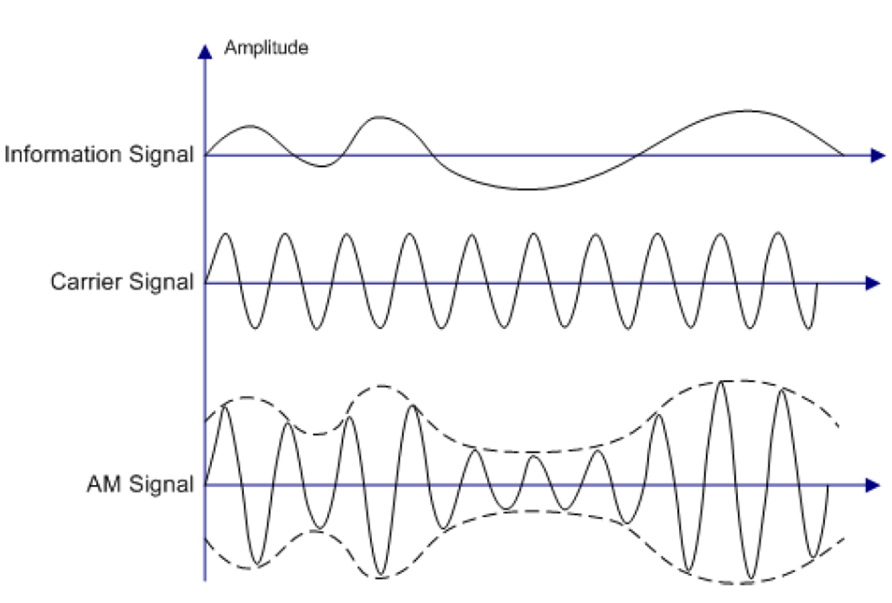
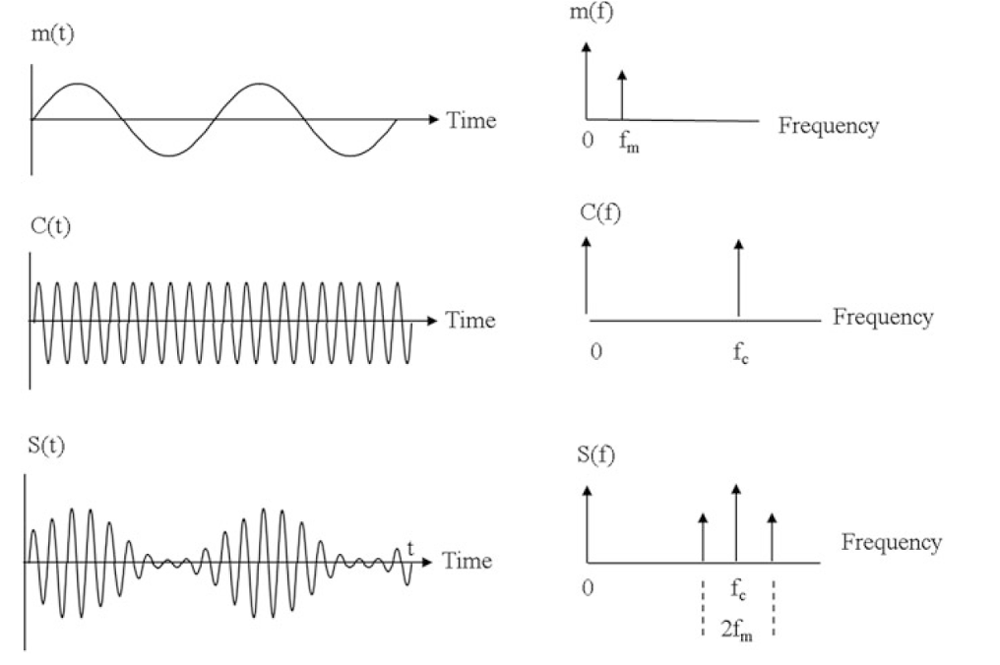

# Introdução à Modulação

> - arquivo pdf do projeto: [Modulação AM](slides.pdf)

A modulação é um processo utilzado em telecomunicações que permite a transmissão de sinais de informação (como voz ou dados) através de um meio de comunicação, utilizando uma onda portadora. 

A onda portadora é uma onda de alta frequência que pode ser facilmente transmitida por meios como cabos, fibras ópticas ou ondas de rádio. 

Ao modular esta portadora com o sinal de informação, conseguimos "carregar" a informação ao longo de distâncias maiores e com menor perda de qualidade. 

Essa técnica é aplicada em áreas como processamento de sinais digitais, sistemas embarcados e redes de comunicação.

As principais propriedades que podem ser modificadas são:

- Amplitude
- Frequência
- Fase

Este processo permite que o sinal de informação seja transmitido a distâncias maiores e com melhor eficiência.

## Tipos de Modulação

Os principais tipos de modulação são:

### Modulação Analógica

- Modulação em Amplitude (AM)
- Modulação em Frequência (FM)
- Modulação em Fase (PM)

### Modulação Digital

- Modulação por Deslocamento de Amplitude (ASK)
- Modulação por Deslocamento de Frequência (FSK)
- Modulação por Deslocamento de Fase (PSK)
- Modulação em Quadratura de Amplitude (QAM)

## Modulação AM (Amplitude Modulation)

A `Modulação em Amplitude (AM)` é uma técnica na qual a amplitude da onda portadora é variada de acordo com o sinal de informação que se deseja transmitir. Nesta modulação, a frequência e a fase da portadora permanecem constantes, enquanto sua amplitude reflete as variações do sinal de áudio ou outro tipo de informação.

## Princípio de Funcionamento

A equação de um sinal AM é dada por:

$$
s(t) = [A_c + A_m \cos(2\pi f_m t)] \cos(2\pi f_c t)
$$

Onde:

- \( s(t) \): Sinal modulado em amplitude.
- \( A_c \): Amplitude da portadora.
- \( A_m \): Amplitude do sinal modulante.
- \( f_c \): Frequência da portadora.
- \( f_m \): Frequência do sinal modulante.

## Índice de Modulação

O **índice de modulação** (\( m \)) expressa a profundidade da modulação:

$$
m = \frac{A_m}{A_c}
$$

- \( 0 \leq m \leq 1 \): Modulação normal.
- \( m > 1 \): Sobremodulação (causa distorção).

## Espectro de Frequência

O espectro de um sinal AM consiste em:

- **Frequência Portadora** (\( f_c \))
- **Banda Lateral Superior** (\( f_c + f_m \))
- **Banda Lateral Inferior** (\( f_c - f_m \))

## Vantagens da Modulação AM

- **Simplicidade de Implementação**: Circuitos menos complexos para modulação e demodulação.
- **Largura de Banda**: Requer largura de banda igual ao dobro da frequência máxima do sinal modulante, o que é relativamente eficiente para sinais de voz.

## Aplicações da Modulação AM

- **Radiodifusão AM**: Transmissões de rádio em ondas médias e curtas.
- **Comunicações Aeronáuticas**: Utilizada em sistemas de comunicação entre aeronaves e controladores de tráfego aéreo.
- **Radiocomunicação de Amadores**: Frequências designadas para operadores de rádio amador.

