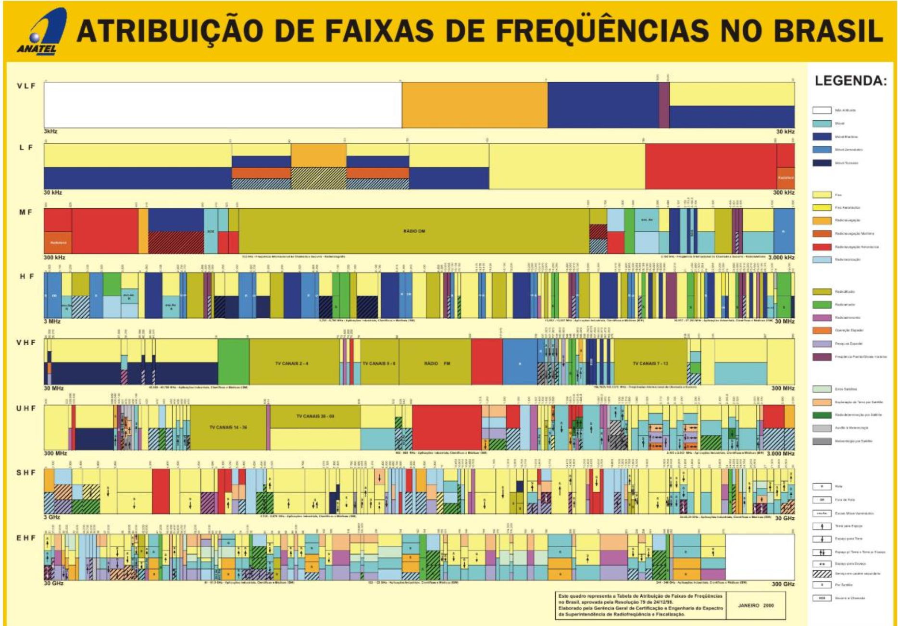
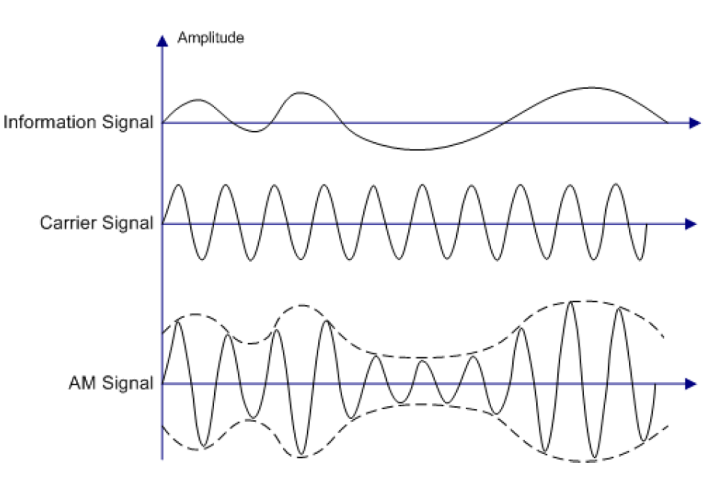
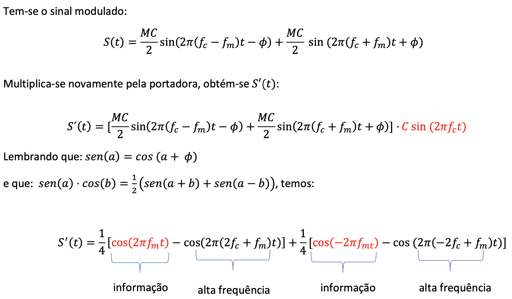
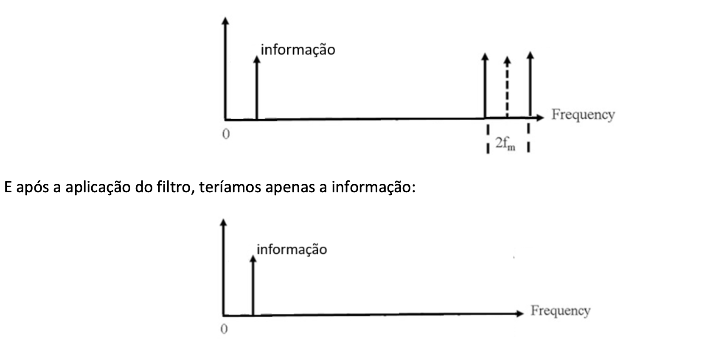
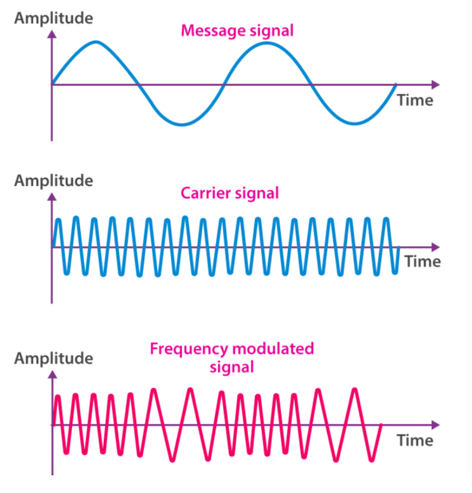
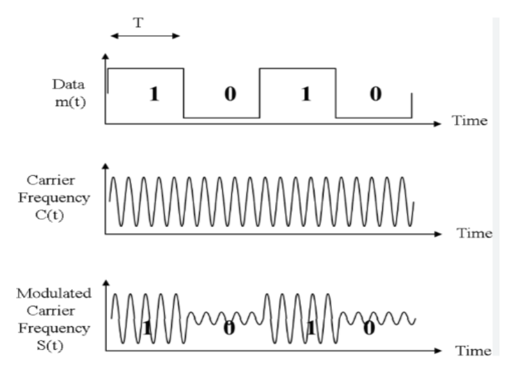
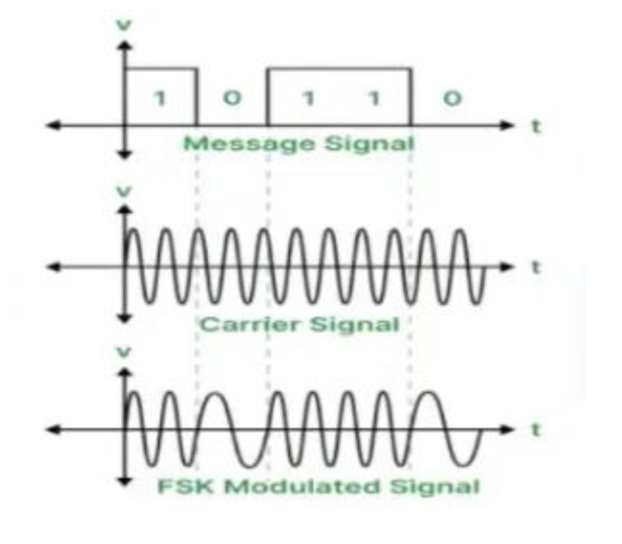
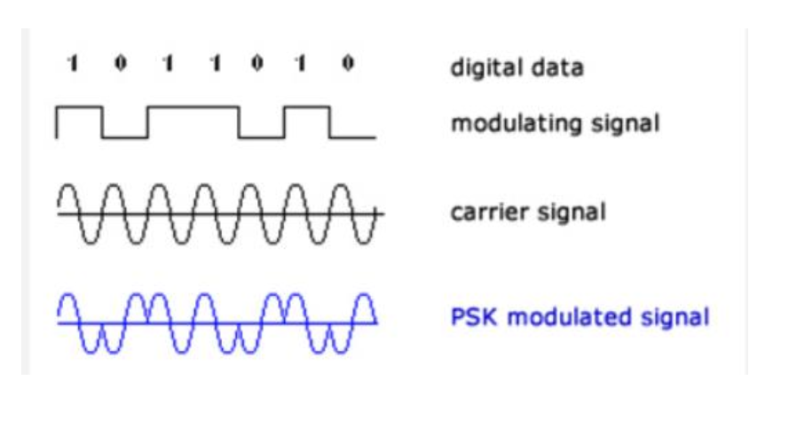
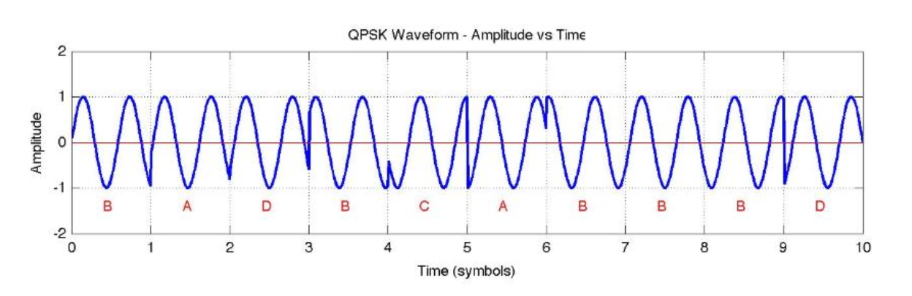
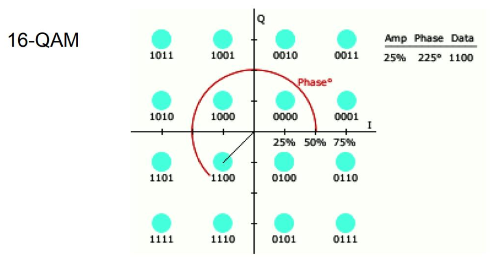

# Modulação

> **Arquivo PDF do projeto**: [Modulação AM](slides.pdf)

## 1. Introdução

Por volta de 1864, o físico James C. Maxwell apresentou uma formulação matemática das ondas eletromagnéticas, prevendo a possibilidade de nos comunicarmos através de ondas de rádio. Pouco mais de 20 anos depois, Heinrich Hertz confirmou experimentalmente as teorias de Maxwell e apresentou um gerador e receptor de ondas eletromagnéticas, embora ainda sem encontrar uma utilidade prática imediata para isso.

A partir daí, em poucos anos, as funcionalidades tornaram-se evidentes e passamos a nos comunicar por meio de ondas eletromagnéticas, inicialmente com telégrafos sem fio e transmissão em código Morse a longas distâncias. No início do século XX, as rádios tornaram-se realidade e, por volta de 1920, as rádios comerciais se expandiram rapidamente.

A evolução das telecomunicações se manteve constante, dando origem a tecnologias como TV, radares, satélites, Wi-Fi, Bluetooth e muitas outras aplicações do mundo atual. Todas elas dependem, de alguma forma, da propagação de ondas eletromagnéticas.

No entanto, três questões fundamentais surgem quando a comunicação por ondas eletromagnéticas se torna uma realidade prática:

1. Para que seja possível a propagação de ondas eletromagnéticas em longas distâncias pela atmosfera, ou mesmo no vácuo, frequências elevadas são necessárias.
2. Se vários emissores funcionarem ao mesmo tempo, os receptores não terão como receber o sinal desejado, pois todos os sinais emitidos serão misturados.
3. Independentemente de como a onda foi produzida pela antena emissora e de seu formato inicial, a propagação atenua o sinal e apenas uma forma senoidal tende a ser transmitida. Como em um sistema de segunda ordem submetido a uma perturbação qualquer, passado o transitório, a oscilação tende a ser senoidal.

Para evitar que os sinais emitidos por múltiplas fontes se misturem, a solução é definir uma faixa de frequência para cada emissor.

Por exemplo, uma rádio à qual é dado o direito de funcionar em uma região a **90,5 MHz** só pode emitir ondas dentro de uma faixa próxima dessa frequência, como algo entre **90,3 MHz e 90,7 MHz**. Caso emita sinais com frequências fora dessa banda, invadiria faixas destinadas a outras rádios.

Essa separação por faixas de frequência é um dos princípios fundamentais dos sistemas de telecomunicações.

---

## Por que precisamos modular sinais?

A separação por faixas de frequência resolve o problema da interferência entre diferentes rádios, mas ainda deixa uma pergunta importante:

> Como uma rádio que opera em uma faixa de frequência entre 90,3 MHz e 90,7 MHz pode transmitir uma música, cujas frequências estão normalmente entre 20 Hz e 20 kHz?

As frequências de interesse do áudio são muito menores do que as frequências que podem ser emitidas pela rádio.

A solução para esse problema está nas técnicas de **modulação**.

A rádio produz uma frequência central em sua faixa permitida, chamada de **onda portadora** (*carrier*, em inglês). No exemplo anterior, a portadora poderia ser uma senoide de frequência **90,5 MHz**.

Por meio de manipulações matemáticas, o sinal que queremos transmitir, como uma música, é codificado nessa senoide portadora. Essa codificação recebe o nome de **modulação**.

---

## Portadora e sinal de informação

Vamos considerar, de maneira genérica, que o sinal de uma onda portadora seja:

$$
C(t) = A_c \cdot \sin(2\pi f_c \cdot t + \phi)
$$

Onde:

- $C(t)$ é o sinal da portadora;
- $A_c$ é a amplitude da portadora;
- $f_c$ é a frequência da portadora;
- $\phi$ é a fase da portadora;
- $t$ representa o tempo.

A portadora possui frequência $f_c$, normalmente muito maior do que as frequências típicas dos sinais $m(t)$ que contêm a informação a ser transmitida, como áudio, voz ou dados.

A solução matemática denominada **modulação** consiste em fazer algum parâmetro da portadora variar no tempo de maneira proporcional ao sinal de informação $m(t)$.

Os parâmetros que podem ser alterados são, principalmente:

- amplitude;
- frequência;
- fase.

Se o parâmetro escolhido for a amplitude $A_c$, a amplitude da portadora passa a variar de acordo com a intensidade do sinal a ser transmitido. Nesse caso, temos a **modulação por amplitude**, ou **AM** (*Amplitude Modulation*).

De forma simplificada, podemos escrever o sinal transmitido como:

$$
S(t) = m(t) \cdot \sin(2\pi f_c \cdot t + \phi)
$$

Nesse caso, a informação é transmitida por meio da variação da amplitude da portadora.

---

## Soma de sinais não é modulação

Antes de estudar a modulação AM propriamente dita, é importante entender uma ideia fundamental:

> Somar o sinal de informação com a portadora não é o mesmo que modular.

Talvez o primeiro palpite seja construir um sinal como:

$$
m(t) + C(t)
$$

Porém, esse sinal resultante não codifica a informação dentro de uma região de altas frequências. Ele apenas contém, simultaneamente, as componentes de frequência do sinal de informação e da portadora.

Pensando no domínio da frequência, a soma de dois sinais mantém componentes nas frequências que compõem ambos os sinais. Portanto, se o sinal de informação possui componentes em baixa frequência, elas continuarão aparecendo na transformada de Fourier do sinal somado.

Isso não atende ao objetivo da modulação, pois queremos transmitir apenas dentro da banda permitida.

!!! exercise
    **Exercício 1**

    Construa uma senoide de frequência **2 kHz**. Considere que essa senoide seja sua informação a ser transmitida.

    Considere também que sua banda permitida de transmissão seja de **12 kHz a 18 kHz**. Dessa forma, a transformada de Fourier do sinal transmitido não pode apresentar componentes, ou harmônicos, fora desse intervalo.

    Construa então uma portadora de **15 kHz** e some à sua senoide que representa a informação. Faça a transformada de Fourier do sinal resultante da soma e verifique que esse sinal não pode ser enviado, pois não está na banda de transmissão.

    Utilize taxa de amostragem de **44100 Hz**. Apresente os gráficos.

---

## Modulação AM

Como podemos fazer a amplitude do sinal da portadora variar de maneira correspondente ao sinal que transmite a informação?

A resposta é: por meio da **multiplicação entre os sinais**.

Isso pode não parecer intuitivo inicialmente, mas a multiplicação entre dois sinais no domínio do tempo produz um deslocamento de componentes no domínio da frequência. Esse deslocamento permite levar a informação para uma faixa de frequência mais alta, próxima à frequência da portadora.

Vamos supor que queremos transmitir uma informação:

$$
m(t) = A_m \cdot \sin(2\pi f_m t)
$$

E que temos uma portadora:

$$
C(t) = A_c \cdot \sin(2\pi f_c t)
$$

A portadora está no centro da banda permitida para transmissão, e sua frequência é muito maior do que a frequência do sinal de informação.

O sinal modulado em amplitude pode ser construído por:

$$
S(t) = C(t) \cdot m(t)
$$

Ou seja:

$$
S(t) = A_c \sin(2\pi f_c t) \cdot A_m \sin(2\pi f_m t)
$$

Usando relações trigonométricas, é possível mostrar que essa multiplicação gera componentes em torno da frequência da portadora:

$$
f_c - f_m
$$

e

$$
f_c + f_m
$$

Assim, o sinal resultante possui frequências deslocadas para a região da portadora.

De forma geral, o produto pode ser representado como:

$$
S(t) =
\frac{1}{2} A_m A_c
\left\{
\sin[(2\pi f_c + 2\pi f_m)t + \phi]
+
\sin[(2\pi f_c - 2\pi f_m)t + \phi]
\right\}
$$

Repare que o sinal resultante possui componentes dentro do intervalo:

$$
[f_c - f_m,\ f_c + f_m]
$$

Ou seja, podemos garantir que o sinal $S(t)$ está dentro da banda permitida se esse intervalo não ultrapassar os limites da banda.

!!! exercise
    **Exercício 2**

    Considere o exemplo do exercício 1, onde o sinal contendo a informação $m(t)$ seja uma senoide de frequência **2 kHz** e a portadora seja uma senoide de **15 kHz**.

    Nesse caso, qual seria a banda mínima para a transmissão desse sinal modulado em AM através da simples multiplicação entre os sinais?

!!! exercise
    **Exercício 3**

    Construa os sinais $m(t)$ e $C(t)$ com os valores do exercício anterior, **2 kHz** e **15 kHz**.

    Utilize sinais com **2 segundos** de duração e amostragem de **44100 Hz**.

    Construa então o sinal modulado multiplicando ponto a ponto os sinais.

    Repare que multiplicar ponto a ponto duas listas contendo os sinais fornece o sinal resultante:

    $$
    S(t) = C(t) \cdot m(t)
    $$

    Faça o gráfico da transformada de Fourier da multiplicação e observe que as componentes estão dentro do intervalo mínimo, isto é, dentro da banda permitida.

!!! exercise
    **Exercício 4**

    Considere agora que o sinal contendo a informação $m(t)$ seja composto por muitas senoides cujas frequências variam de **20 Hz até 2000 Hz**.

    Sendo a portadora uma senoide de **15 kHz** e a banda permitida para a transmissão sendo de **14 kHz a 16 kHz**, o que poderia ser feito com o sinal $m(t)$ antes da modulação para podermos modulá-lo dentro da banda permitida?

---

## Demodulação AM

Uma vez que a informação tenha sido modulada e transmitida, o receptor precisa recuperar a informação presente no sinal transmitido.

A **demodulação de um sinal AM** consiste no processo de recuperar a informação original, geralmente áudio ou dados, que foi transmitida por meio da modulação da amplitude de uma portadora senoidal.

Existem várias formas de demodular um sinal AM. As principais são:

### 1. Demodulação por detecção de envoltória

Esse é o método mais simples e mais comum para sinais AM de dupla banda lateral com portadora.

Essa demodulação é feita analogicamente, em duas etapas:

- o sinal AM passa por um diodo retificador, que permite apenas a parte positiva ou negativa do sinal;
- um capacitor e um resistor formam um filtro passa-baixa, suavizando a forma de onda e extraindo a envoltória, que corresponde à forma original da mensagem.

### 2. Demodulação síncrona ou coerente

Essa demodulação pode ser feita digitalmente em duas etapas:

- o sinal AM é multiplicado por uma cópia da portadora original, ou por uma portadora recriada localmente com mesma frequência e fase;
- essa multiplicação desloca o espectro e permite recuperar o sinal original por meio de uma filtragem passa-baixa.

Neste projeto, a demodulação será feita digitalmente por meio da **demodulação síncrona**. Para isso, basta multiplicar o sinal modulado pela portadora novamente e, em seguida, aplicar um filtro passa-baixa.

Primeiramente, considere o sinal modulado. Ao multiplicá-lo novamente pela portadora, obtém-se um novo sinal $S'(t)$.

De forma simplificada, essa multiplicação produz dois tipos de componentes:

- componentes relacionadas à informação original;
- componentes de alta frequência.

As componentes de alta frequência podem ser eliminadas por um filtro passa-baixa, restando a informação original.

!!! exercise
    **Exercício 5**

    Para esse exercício, use um arquivo de áudio de poucos segundos.

    1. Examine o gráfico da transformada de Fourier desse áudio e repare na faixa, ou banda, de frequências que o sinal ocupa. Execute o áudio.
    2. Gere uma portadora de **16 kHz** com exatamente o mesmo número de pontos que o sinal.
    3. Module o sinal em AM através da multiplicação de modo que o sinal modulado esteja dentro da faixa de **14 kHz a 18 kHz**. Note que talvez você precise tratar o sinal original, antes da modulação, para que ele possa ser acomodado dentro da faixa pedida.
    4. Faça o gráfico de Fourier do sinal modulado e verifique se está dentro da banda.
    5. Execute o áudio do sinal modulado.
    6. Demodule o sinal através da multiplicação e aplique o filtro passa-baixa.
    7. Faça o gráfico da transformada de Fourier do sinal demodulado e verifique que o sinal original foi recuperado.
    8. Execute o sinal demodulado.

---

## Modulação FM

A **modulação em frequência**, ou **FM** (*Frequency Modulation*), é um tipo de modulação analógica em que a frequência da portadora é variada de acordo com a amplitude do sinal de informação, chamado também de sinal modulante.

Nesse caso, a amplitude da portadora permanece constante, enquanto sua frequência sofre pequenas variações controladas pelo sinal de informação.

Matematicamente, um sinal modulado em frequência pode ser representado por uma portadora cuja frequência é controlada pelo sinal a ser transmitido $m(t)$:

$$
S'(t) = A_c \cos(2\pi f_c \cdot t + \phi(t))
$$

Nessa expressão, $\phi(t)$ é uma fase controlada pelo sinal $m(t)$.

Uma forma de representar essa relação é:

$$
\phi(t) = \int_0^t m(\tau) \, d\tau
$$

Ou seja, o sinal $m(t)$ atua como uma frequência adicional que, ao ser integrada, gera uma fase que se soma à fase da portadora.

Existem dispositivos analógicos e digitais que geram sinais modulados em FM. Digitalmente, essa modulação pode ser feita por algoritmos específicos.

Para a demodulação FM, também há dispositivos capazes de comparar a fase do sinal modulado à fase de uma portadora, extraindo a diferença entre as fases. Diferenciando-se essa diferença de fases, obtém-se o sinal original $m(t)$.

---

## Modulação Digital

Na **modulação digital**, os dados binários, isto é, os bits 0 e 1, são usados para alterar alguma característica de uma onda portadora.

Essa característica pode ser:

- amplitude;
- frequência;
- fase;
- ou uma combinação dessas grandezas.

O objetivo é transmitir bits por meio de sinais analógicos que possam se propagar por canais físicos, como cabos, rádio, fibra óptica, entre outros.

---

## Tipos de modulação digital

### ASK – Amplitude Shift Keying

Na **ASK** (*Amplitude Shift Keying*), ou modulação por chaveamento de amplitude, a amplitude da portadora varia de acordo com o bit transmitido.

Exemplo:

- bit 1 → onda com amplitude $A$;
- bit 0 → onda com amplitude 0 ou menor.

### FSK – Frequency Shift Keying

Na **FSK** (*Frequency Shift Keying*), ou modulação por chaveamento de frequência, a frequência da portadora muda conforme o bit transmitido.

Exemplo:

- bit 0 → frequência $f_0$;
- bit 1 → frequência $f_1$.

### PSK – Phase Shift Keying

Na **PSK** (*Phase Shift Keying*), ou modulação por chaveamento de fase, a fase da portadora é alterada para representar os bits.

Exemplo simples:

- bit 0 → fase de 0°;
- bit 1 → fase de 180°.

### QPSK – Quadrature PSK

Na **QPSK** (*Quadrature Phase Shift Keying*), a fase da portadora pode assumir quatro valores diferentes.

Com isso, é possível transmitir **2 bits por símbolo**.

Exemplo:

- 0° → 00;
- 90° → 01;
- 180° → 10;
- 270° → 11.

A QPSK é mais eficiente que a PSK simples, pois transmite mais bits por símbolo.

### QAM – Quadrature Amplitude Modulation

Na **QAM** (*Quadrature Amplitude Modulation*), amplitude e fase são combinadas.

Essa técnica é muito usada em sistemas como Wi-Fi, 4G, 5G e TV digital.

Exemplos:

- 16-QAM → transmite 4 bits por símbolo;
- 64-QAM → transmite 6 bits por símbolo;
- 256-QAM → transmite 8 bits por símbolo.

No caso da 16-QAM, por exemplo, há combinações de amplitudes e fases que formam diferentes símbolos. Cada símbolo representa um conjunto de bits.

!!! exercise
    **Exercício 6**

    Um sinal digital foi modulado utilizando-se a técnica **64-QAM**, onde tanto a amplitude como a fase podem variar em **8 níveis**: 8 possíveis fases e 8 possíveis amplitudes.

    Considere que a portadora utilizada foi uma onda com frequência **2,4 GHz**.

    Considere ainda que, tanto na modulação quanto na demodulação, a fase e a amplitude da portadora sofriam variações apenas a cada **dois períodos**, garantindo a estabilidade de cada estado por limitações de hardware.

    Assim, cada conjunto de bits era modulado a cada dois períodos e o mesmo ocorreu na demodulação, com o estado de fase e amplitude lido a cada dois períodos.

    Nessas condições, qual a taxa de transmissão possível através desse sinal modulado?

!!! exercise
    **Exercício 7**

    Um sinal digital foi modulado utilizando-se a técnica **256-QAM**, onde tanto a amplitude como a fase podem variar em **16 níveis**.

    Considere que a portadora utilizada foi uma onda com frequência **2,4 GHz**.

    Considere ainda que, tanto na modulação quanto na demodulação, a fase e a amplitude da portadora sofriam variações, no mínimo, a cada **10 períodos**.

    Quanto tempo esse sinal levaria para transmitir **480 MBytes**?
