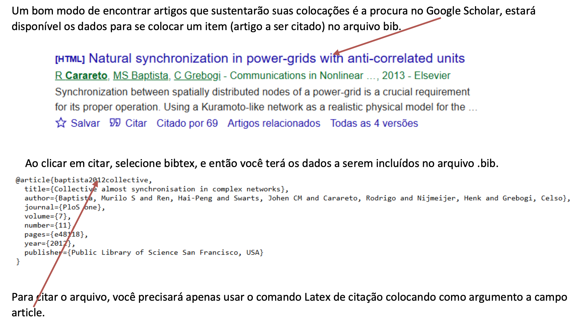

# CAMADA FÍSICA DA COMPUTAÇÃO

**ENGENHARIA DA COMPUTAÇÃO - Rodrigo Carareto**

## Divulgação Científica

As revistas acadêmicas indexadas são publicações científicas reconhecidas por fazerem parte de bases de dados especializadas, chamadas de indexadores. Essas revistas têm como principal objetivo divulgar pesquisas científicas produzidas por pesquisadores, professores e estudantes de universidades e centros de pesquisa.

Diferentemente das revistas de divulgação científica, que utilizam uma linguagem mais acessível ao público geral, as revistas acadêmicas apresentam textos técnicos, estruturados de acordo com normas científicas e voltados para a comunidade acadêmica. Nelas são publicados artigos originais, revisões de literatura, estudos de caso e resultados de pesquisas.

Uma característica importante dessas revistas é o processo de revisão por pares (“peer review”). Antes de um artigo ser publicado, ele é avaliado por especialistas da mesma área do conhecimento, que analisam a qualidade da metodologia, a relevância do tema, a clareza dos resultados e a consistência científica do trabalho. Esse processo ajuda a garantir maior confiabilidade às informações publicadas.

Quando uma revista é considerada “indexada”, significa que ela foi incluída em bases de dados reconhecidas nacional ou internacionalmente, como SciELO, Scopus, Web of Science e PubMed. Para ser aceita nesses indexadores, a revista precisa cumprir critérios de qualidade editorial, regularidade de publicação, padronização e rigor científico.

A indexação é importante porque aumenta a visibilidade e a credibilidade da revista e dos artigos nela publicados. Pesquisas publicadas em revistas indexadas têm maior chance de serem encontradas, lidas e citadas por outros pesquisadores. Além disso, em muitos cursos de graduação e pós-graduação, a publicação em periódicos indexados é considerada um indicador de qualidade acadêmica.

Para vocês. estudantes de graduação, compreender o funcionamento das revistas acadêmicas indexadas é fundamental, pois elas representam uma das principais fontes de informação científica confiável. Consultar artigos publicados nesses periódicos contribui para o desenvolvimento do pensamento crítico, da capacidade de pesquisa e da formação acadêmica baseada em evidências científicas.

Algumas revistas acadêmicas indexadas são reconhecidas mundialmente pela qualidade científica, pelo rigor na avaliação dos artigos e pelo grande impacto das pesquisas que publicam. Abaixo estão alguns exemplos bastante conhecidos, organizados por áreas do conhecimento.

## Exemplos de revistas indexadas em Computação

### Inteligência Artificial e Ciência de Dados

- Artificial Intelligence
- Journal of Artificial Intelligence Research (JAIR)
- IEEE Transactions on Neural Networks and Learning Systems
- Machine Learning
- Data Mining and Knowledge Discovery

Essas revistas publicam pesquisas sobre IA, aprendizado de máquina, mineração de dados e redes neurais.

### Engenharia de Software

- IEEE Transactions on Software Engineering
- Empirical Software Engineering
- Journal of Systems and Software
- Software: Practice and Experience

São importantes para pesquisas sobre desenvolvimento, testes, qualidade e manutenção de software.

### Redes e Sistemas Computacionais

- Computer Networks
- IEEE/ACM Transactions on Networking
- Journal of Network and Computer Applications
- Future Generation Computer Systems

Publicam estudos sobre redes, computação distribuída, nuvem e infraestrutura computacional.

### Segurança da Informação

- Computers & Security
- IEEE Transactions on Information Forensics and Security
- Journal of Cybersecurity

Focadas em criptografia, proteção de dados, segurança digital e privacidade.

### Computação em geral

- Communications of the ACM
- IEEE Computer
- ACM Computing Surveys
- The Computer Journal

Abrangem diversos temas da computação e frequentemente publicam revisões e tendências tecnológicas.

## Revistas brasileiras em Computação

Algumas revistas brasileiras também possuem indexação importante:

- Journal of the Brazilian Computer Society (JBCS)
- Revista Brasileira de Computação Aplicada
- iSys – Revista Brasileira de Sistemas de Informação

Muitas delas estão indexadas em bases como:

- SciELO
- Scopus
- DBLP
- Google Scholar

## Revistas multidisciplinares

Publicam pesquisas de diversas áreas da ciência.

- Nature
- Science
- Proceedings of the National Academy of Sciences (PNAS)

Essas estão entre as revistas científicas mais prestigiadas do mundo.

## Área da saúde e medicina

- The Lancet
- New England Journal of Medicine (NEJM)
- JAMA (Journal of the American Medical Association)
- BMJ (British Medical Journal)

São referências em pesquisas médicas e saúde pública.

## Ciências humanas e sociais

- American Sociological Review
- Educational Research Review
- Journal of Educational Psychology
- Revista Brasileira de Educação

## Engenharia e tecnologia

- IEEE Access
- IEEE Transactions
- ACM Computing Surveys
- Computer Networks

Muito utilizadas nas áreas de computação, engenharia elétrica e tecnologia.

## Administração e economia

- Harvard Business Review (mais voltada à gestão e divulgação especializada)
- Academy of Management Journal
- Journal of Finance
- Econometrica

## Revistas brasileiras indexadas conhecidas

Muitas estão presentes em bases como SciELO e Scopus.

- Pesquisa FAPESP (divulgação científica)
- Cadernos de Saúde Pública
- Revista de Saúde Pública
- Revista Brasileira de Educação
- Ciência & Saúde Coletiva
- Memórias do Instituto Oswaldo Cruz

## Principais bases de indexação onde essas revistas aparecem

- Scopus
- Web of Science
- SciELO
- PubMed
- DOAJ

## Editoras

Uma mesma editora pode publicar várias revistas acadêmicas indexadas, muitas vezes em diferentes áreas do conhecimento.

Na prática, a editora funciona como a instituição responsável pela:

- organização editorial;
- publicação dos periódicos;
- gerenciamento das submissões;
- padronização científica;
- divulgação das revistas.

Cada revista, porém, possui:

- seu próprio nome;
- ISSN;
- conselho editorial;
- área temática;
- critérios de avaliação;
- indexação específica.

Como exemplo, atualmente há grandes editoras como a Elsevier, Springer Nature e IEEE.

## Fator de impacto

O fator de impacto é uma métrica utilizada para medir a relevância e a influência de uma revista científica dentro da comunidade acadêmica. Ele indica, em média, quantas vezes os artigos publicados em uma revista foram citados por outros pesquisadores em determinado período.

De maneira geral, quanto maior o fator de impacto, maior tende a ser a visibilidade e o prestígio da revista científica.

O cálculo do fator de impacto de uma dada revista considera o número de citações recebidas pelos artigos da revista dividido pela quantidade de artigos publicados.

Normalmente, o cálculo utiliza um período de dois anos.

### Exemplo simples

Imagine que uma revista publicou:

- 100 artigos em dois anos.

Esses artigos receberam:

- 500 citações no total.

Então: fator de impacto igual a 5. E isso significa que, em média, cada artigo foi citado cinco vezes.

Um fator de impacto alto geralmente sugere que:

- os artigos da revista são bastante utilizados por outros pesquisadores;
- a revista possui grande circulação acadêmica;
- o periódico tem relevância científica na área.

Por isso, muitas universidades e programas de pós-graduação consideram essa métrica ao avaliar publicações científicas.

Não é correto comparar diretamente revistas de áreas diferentes.

Por exemplo:

- Medicina costuma ter fatores de impacto muito altos;
- Matemática e Computação frequentemente possuem valores menores.

Assim, uma revista com fator 4 em Computação pode ser extremamente respeitada, enquanto em Medicina esse valor pode ser considerado mediano.

## Latex

O editor LaTeX é uma ferramenta usada para escrever documentos científicos e técnicos com alta qualidade tipográfica, especialmente quando esses documentos contêm fórmulas matemáticas, tabelas, figuras e referências. É um sistema de preparação de documentos baseado em comandos de marcação. Em vez de formatar o texto “à mão” como no Word, você escreve o conteúdo com código e o LaTeX gera um PDF bonito, com estrutura profissional!

Você deverá usar um programa editor, que é o programa (ou ambiente online) onde você escreve, edita e compila seus arquivos .tex. Existem vários editores, por exemplo:

[Overleaf](https://www.overleaf.com/) - online, atualmente o mais popular, colaborações em tempo real, compilação automática.

TeXstudio - offline, necessita do compilador.

TeXmaker - offline, necessita do compilador.

LyX- offline, necessita do compilador, tem uma interface mais amigável, parecida com Word, mas baseada em LaTeX.

Você deverá se familiarizar com esse novo modo de produção de textos.Com uma simples pesquisa Google com “Latex tutorial” você encontrará dezenas de textos e vídeos para iniciar seu aprendizado! Veja como construir as citações utilizando um arquivo .bib.

Um bom modo de encontrar artigos que sustentarão suas colocações é a procura no Google Scholar, estará disponível os dados para se colocar um item (artigo a ser citado) no arquivo bib.

[

Ao clicar em citar, selecione bibtex, e então você terá os dados a serem incluídos no arquivo .bib.

```bibtex
@article{baptista2012collective,
  title={Collective almost synchronisation in complex networks},
  author={Baptista, Murilo S and Ren, Hai-Peng and Swarts, Johen CM and Carareto, Rodrigo and Nijmeijer, Henk and Grebogi, Celso},
  journal={PloS one},
  volume={7},
  number={11},
  pages={e48118},
  year={2012},
  publisher={Public Library of Science San Francisco, USA}
}
```

Para citar o arquivo, você precisará apenas usar o comando Latex de citação colocando como argumento a campo article.


