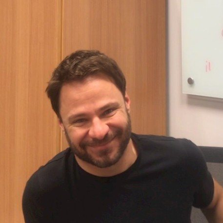

# Camada Física da Computação

Essa página contém todos os materiais para o curso de Camada Física da Computação de 2024-b. 

## Estrutura do Curso

O curso é estruturado em 9 projetos:

- **Projeto 1**: Loop-back
- **Projeto 2**: Client-Server Simples
- **Projeto 3**: Client-Server Completo
- **Projeto 4**:
- **Projeto 5**: Uart por software
- **Projeto 6**: DTMF
- **Projeto 7**: Transmissõa de áudio
- **Projeto 8**:
- **Projeto 9**: Artigo Ciêntifico

Cada projeto tem a duração de uma semana.

### Dinâmica das aulas

A cada projeto, os alunos participarão de:

- Aulas expositivas;
- Atividades práticas guiadas para o desenvolvimento do projeto.

### Avaliações

- A cada projeto é realizada uma avaliação QUIZ e no final do semestre a avaliação final (AF),é realizada na semana definida no calendário acadêmico.

### Critérios de avaliação

- [Critérios de avaliação](criterios.md)

## Principais conteúdos abordados:

## Repositório 

Github da disciplina, pode ser acessado no link:

- [Github Camada Física](https://github.com/Insper/camadafisica). 

## Aulas

**Laboratório de Informática** - Sala 404

- **Quinta-feira** 13:30 
- **Sexta-feira** 15:45

Horário de atendimento: 

- **Segunda-feira** xx:00  - sala xx

## Equipe

!!! people "Equipe"
    -  **Rodrigo Carareto** *Professor*
    -  **Arnaldo Alves Viana Junior** *Prof. Auxiliar*
    -  **Rogério Cuenca** *Técnico de lab*
    
    <!-- - **Rodrigo Carareto** *Professor*
    - **Arnaldo Alves Viana Junior** *Prof. Auxiliar*
    - **Rogério Cuenca** *Técnico de lab* -->