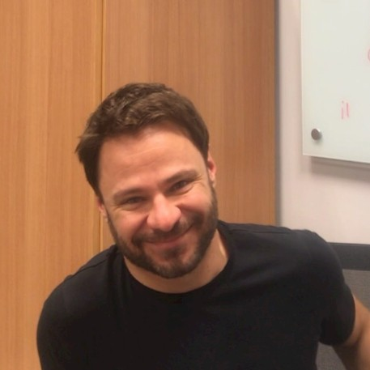

# Camada Física da Computação

Essa página contém todos os materiais para o curso de Camada Física da Computação de 2026. 

## Estrutura do Curso

O curso é estruturado em 9 projetos:

- **Projeto 1**: Loop-back
- **Projeto 2**: Client-Server
- **Projeto 3**: Datagrama
- **Projeto 4**: Checksum
- **Projeto 5**: Serialização Uart (arduino)
- **Projeto 6**: DTMF
- **Projeto 7**: Filtro Digital
- **Projeto 8**: Modulação AM
- **Projeto 9**: Produção Ciêntífica

### Dinâmica das aulas

A cada projeto, os alunos participarão de:

### Avaliações

- Os projetos são desenvolvidos em duplas. Cada dupla deve apresentar o projeto em sala de aula.
- O quizz será aplicado após cada projeto. o aluno só podera fazer o quizz se tiver apresentado o projeto.

### Critérios de avaliação

- Prova final: peso 50%
- Média quizzes: peso 50%

Aprovação média ponderada maior ou igual a 5.

## Principais conteúdos abordados:

### Sobre o curso

Esta disciplina explora os fundamentos teóricos e práticos da camada física em sistemas computacionais e redes de comunicação. Aborda os princípios de transmissão de dados, tipos de sinais, meios de transmissão, técnicas de modulação e codificação, além dos padrões e protocolos associados à camada física.

### Objetivos:

- Compreender os conceitos básicos de transmissão de sinais em sistemas digitais.
- Identificar e analisar os diferentes meios de transmissão e suas características.
- Estudar as técnicas de modulação e codificação utilizadas na comunicação de dados.
- Familiarizar-se com os padrões e protocolos relacionados à camada física.
- Aplicar conhecimentos em atividades práticas e laboratoriais em grupo.

## Aulas

**Laboratório de Informática** - Sala 404

- **Segunda-feira** 9:45
- **Quinta-feira** 14:15 

Horário de atendimento: 

- **Quarta-feira** 12:00  - Sala 404

## Equipe

!!! people "Equipe"
    -  **Rodrigo Carareto** *Professor*
    -  **Arnaldo Alves Viana Junior** *Prof. Auxiliar*
   